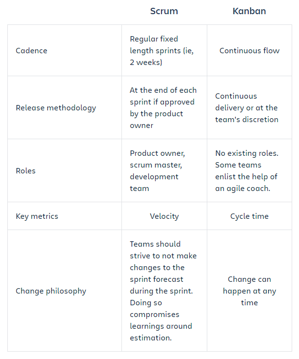

# Kanban

## What is Kanban?
Kanban is a popular framework used to implement agile software development. It requires real-time communication of capacity and full transparency of work. Work items are represented visually on a kanban board, allowing team members to see the state of every piece of work at any time.

### Kanban boards
The work of all kanban teams revolves around a kanban board, a tool used to visualize work and optimize the flow of the work among the team. While physical boards are popular among some teams, virtual boards are a crucial feature in any agile software development tool for their traceability, easier collaboration, and accessibility from multiple locations.

Regardless of whether a team's board is physical or digital, their function is to ensure the team's work is visualized, their workflow is standardized, and all blockers and dependencies are immediately identified and resolved. A basic kanban board has a three-step workflow: To Do, In Progress, and Done. However, depending on a team's size, structure, and objectives, the workflow can be mapped to meet the unique process of any particular team.

### Kanban cards
In Japanese, kanban literally translates to "visual signal." For kanban teams, every work item is represented as a separate card on the board.

The main purpose of representing work as a card on the kanban board is to allow team members to track the progress of work through its workflow in a highly visual manner. Kanban cards feature critical information about that particular work item, giving the entire team full visibility into who is responsible for that item of work, a brief description of the job being done, how long that piece of work is estimated to take, and so on. 

## The benefits of Kanban
### Planning flexibility
A kanban team is only focused on the work that's actively in progress. Once the team completes a work item, they pluck the next work item off the top of the backlog. The product owner is free to reprioritize work in the backlog without disrupting the team, because any changes outside the current work items don't impact the team. As long as the product owner keeps the most important work items on top of the backlog, the development team is assured they are delivering maximum value back to the business. So there's no need for the fixed-length iterations you find in scrum.

### Shortened time cycles
Cycle time is a key metric for kanban teams. Cycle time is the amount of time it takes for a unit of work to travel through the team’s workflow–from the moment work starts to the moment it ships. By optimizing cycle time, the team can confidently forecast the delivery of future work.

Overlapping skill sets lead to smaller cycle times. When only one person holds a skill set, that person becomes a bottleneck in the workflow. So teams employ basic best practices like code review and mentoring help to spread knowledge. Shared skills mean that team members can take on heterogeneous work, which further optimizes cycle time. It also means that if there is a backup of work, the entire team can swarm on it to get the process flowing smoothly again. For instance, testing isn't only done by QA engineers. Developers pitch in, too.

In a kanban framework, it's the entire team's responsibility to ensure work is moving smoothly through the process.

### Fewer bottlenecks
Multitasking kills efficiency. The more work items in flight at any given time, the more context switching, which hinders their path to completion. That's why a key tenant of kanban is to limit the amount of work in progress (WIP). Work-in-progress limits highlight bottlenecks and backups in the team's process due to lack of focus, people, or skill sets.

For example, a typical software team might have four workflow states: To Do, In Progress, Code Review, and Done. They could choose to set a WIP limit of 2 for the code review state. That might seem like a low limit, but there's good reason for it: developers often prefer to write new code, rather than spend time reviewing someone else's work. A low limit encourages the team to pay special attention to issues in the review state, and to review others work before raising their own code reviews. This ultimately reduces the overall cycle time.

## What are WIP limits?
In agile development, work in progress (WIP) limits set the maximum amount of work that can exist in each status of a workflow. Limiting the amount of work in progress makes it easier to identify inefficiency in a team's workflow. Bottlenecks in a team's delivery pipeline are clearly visible before a situation becomes dire.

## Kanban vs. Scrum

[Next to Kanban tutorial...](https://www.atlassian.com/agile/tutorials/how-to-do-kanban-with-jira-software)
