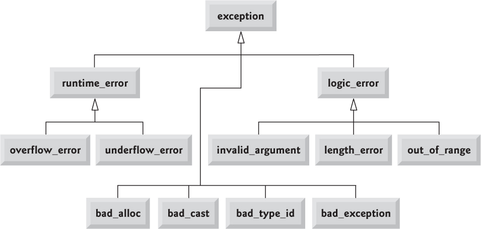

# Exception 補充

## 拋擲異常

### 異常與指標
如果我們拋擲 (`throw`) 指標本身。更明確地說，拋擲一個 local 物件指標，永遠是錯誤的，因為處理單元位於另一個函式中，那麼處理單元執行起來時該物件以不再存在。

### 解構式永遠不該拋擲異常
解構式常會在堆疊輾轉開解時執行起來，當他執行時，異常已被觸發，但尚未被處理。如果解構式本身又拋擲一個異常，沒人知道會形成什麼結果。

答案是，當堆疊輾轉開解過程正在處理一個異常時，如果解構式拋出一個自己並不處理的異常，會導致標準庫的 `terminate()` 被喚起，通常 `terminate()` 會呼叫 `abort()`，強制結束整個程式。

所以讓解構式進行任何 "可能導致異常的工作" 是很糟糕的想法。

### 未被捕獲的異常會結束程式
異常是 "造成程式不能繼續正確執行的一個重大事件"。如果編譯器沒能夠找到匹配的 `catch`，會喚起標準庫的 `terminate()`。

```cpp
try {
// program-statements
} catch (/*exception-specifier*/) {
// handler-statements
} catch (/*exception-specifier*/) {
// handler-statements
}
```

## 捕捉異常
`catch` 子句中的異常指示 (exception specifier) 形式很像 "只含一個引數" 的引數列。異常指示由型別名稱和其後的引數名稱組成。

### 異常指示 (Exception Specifiers)
如果異常指示的型別不是個 reference，那麼異常物件就會被複製給 `catch` 參數。`catch` 子句操作的是異常物件的 local 複件。作用於 `catch` 參數身上的任何改變，影響的都是複件而非異常物件本身。但是如果異常指示是個 reference，那麼就像 reference 參數一樣，不另外存在一份供 `catch` 使用的物件，此時的 `catch` 參數只是異常物件的別名而已，對它所做的任何改變都將直接影響異常物件本身。

### 異常指示 (Exception Specifiers) 與繼承
通常，如果異常物件的型別與某個繼承體系有關，打算處理它的 `catch` 子句應該將其參數定義為一個 reference。

### `catch` 子句的順序必須反映出型別階層體系
如果一群 `catch` 子句所處理的異常型別組成了一個繼承體系，這些 `catch` 子句應該按其所處理的異常型別在繼承體系中的順序來排列，從最底層 (子) 至最頂層 (父)。

## 復拋 (Rethrow)
有可能單個 `catch` 無法徹底處理某個異常，`catch` 可能會決定讓其函式呼叫鏈的更上層函式來處理這個異常。`catch` 可以復拋 (rethrowing) 異常，將異常傳給更上層的 `catch`。復拋形式如下:

```cpp
throw;
```

復拋並不明示其異常物件，它沿著函式呼叫鏈向上傳遞一個異常物件，那是最初的物件，不是 `catch` 參數所表現的那個。

通常 `catch` 區塊內有可能修改其參數內容。在那之後如果復拋異常，只有當異常是以 reference 傳入，那些修改才會傳遞出去:

```cpp
catch (my_error &eObj) {     // 異常指示是個 reference type
    eObj.status = severeErr; // 改動異常物件
    throw;                   // 異常物件的 status 成員內容變成了 severeErr
} catch (other_error eObj) { // 異常指示是個 nonreference type
    eObj.status = badErr;    // 只改動了異常物件的 local 復件
    throw;                   // 異常物件的 status 成員內容沒有變化
}
```

## Catch-ALL 處理單元
有可能函式希望在結束之前對被拋擲的異常採取某些行為 - 即使它不能料理好這個異常。

我們可以使用 "捕捉所有" (catch-all) 的 `catch` 句法，它可以匹配任何種類的異常。

```cpp
void manip() {
    try {
        // 這裡的動作引發異常被拋出
    } catch (...) {
        // 這裡進行部分處理
        throw;
    }
}
```

#### 關鍵
`catch(...)` 如果被拿來和其他 `catch` 聯合使用，必須最後出現，否則其後的任何 `catch` 都不可能獲得機會。

## Function Try Blocks 與建構式
如果異常發生在建構是初值列中。由於初值設定列會在建構式之前更早被處理，因此一個位於建構式內的 `catch` 子句無法處理可能來自初值設定列的異常。

為了處理這種來自建構式初值設定列的異常，我們必須將建構是寫成 function try block 形式。 下面寫法為了檢測 `new` 所產生錯誤:

```cpp
template <class T> Handle<T>::Handle(T *p) try : 
    ptr(p), use(new size_t(1))
{

} catch (const std::bad_alloc &e) {
    handle_out_of_memory(e);
}
```

## Exception Classes 階層體系
標準的 exception classes 適用於許多程式，應用程式也常常從 `exception` 衍生出其他型別，從而擴展 `exception` 繼承體系。這些 derived classes 可以表現程式專屬的異常型別。

下圖為: 標準的 `exception` classses 繼承體系


## 自動式資源釋放
當異常發生，local 物件會被自動銷毀，解構式會被喚起。這一點對編程是個重要暗示。這也是我們鼓勵使用標準庫的原因之一。考慮以下函式:

```cpp
void f()
{
    vector<string> v;
    string s;
    while(cin >> s)
        v.push_back(s);
    string *p = new string[v.size()]; // 動態配置 array
    // 其他動作
    // 這裡可能發生異常
    delete [] p;
    // 當函式退出，v 會被自動銷毀
}
```

如果在 "`new` 之後，對應的 `delete` 之前" 發生異常，`vector` 仍會被銷毀而 array 不會被釋放。

### 以 Classes 管理資源
"解構式會被喚起" 的事實使程式更加具備了 **異常安全性** (exception-safe)。

所謂異常安全性，是指 "即使發生異常程式也可以正常運行"。以本章對安全的定義是，在發生異常時，保證已配置的資源都能被正確釋放。

#### 重點
凡是 "配置資源並可能發生異常" 的程式，都應該使用 class 來管理資源。以 classes 獲取和釋放資源，可保證資源被正確釋放，即使在發生異常的情況下。

## 異常規格 (Exception Specifications)
當我們看到一個一般的函式宣告，無法得知該函式可能拋擲什麼異常。然而 "知道函式可能會拋擲什麼異常" 會對正確編寫 `catch` 子句有好處。**異常規格 (exception specification)** 就是用來指示函式是否拋擲異常。

### 定義一個異常規格 (Exception Specification)
以下異常規格表示函式不拋擲任何異常:

```cpp
void no_problem() noexcept;
```

### 違背異常規格
如果函式拋出一個並未列名於異常規格中的異常，那麼 C++ 標準庫 `unexpected()` 會起而執行，預設情況下會呼叫 `terminate()` 終止程式。

#### 注意
編譯器不能也不會在編譯期對異常規格進行檢測。

# Qt Exception Safety
[參考官方文件連結](https://doc.qt.io/qt-5/exceptionsafety.html)

# 常見問題
- [Exceptions and Error Handling FAQ](https://isocpp.org/wiki/faq/exceptions)
- [Exception object lifetime](https://stackoverflow.com/questions/12999448/exception-object-lifetime)
- [Scope of exception object in C++](https://stackoverflow.com/questions/1654150/scope-of-exception-object-in-c/1654187#1654187)
- [What is the purpose of a function try block? - 1](https://stackoverflow.com/questions/14681714/using-new-in-a-member-initializer-list-of-constructor)
- [What is the purpose of a function try block? - 2](https://stackoverflow.com/questions/8359635/what-is-the-purpose-of-a-function-try-block)

