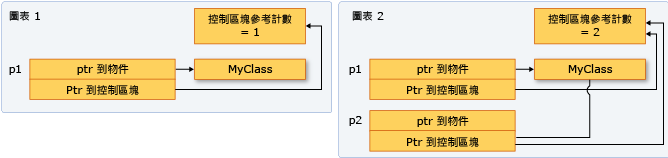

# Smart Pointer
In modern C++ programming, the Standard Library includes smart pointers, which are used to help ensure that programs are free of memory and resource leaks and are exception-safe.

### Uses for smart pointers
Smart pointers are defined in the `std` namespace in the `<memory>` header file. They are crucial to the **[RAII](https://en.cppreference.com/w/cpp/language/raii)** or *Resource Acquisition Is Initialization programming* idiom. The main goal of this idiom is to ensure that resource acquisition occurs at the same time that the object is initialized, so that all resources for the object are created and made ready in one line of code. In practical terms, the main principle of RAII is to give ownership of any heap-allocated resource—for example, dynamically-allocated memory or system object handles—to a stack-allocated object whose destructor contains the code to delete or free the resource and also any associated cleanup code.

In most cases, when you initialize a raw pointer or resource handle to point to an actual resource, pass the pointer to a smart pointer immediately. In modern C++, raw pointers are only used in small code blocks of limited scope, loops, or helper functions where performance is critical and there is no chance of confusion about ownership.

The following example compares a raw pointer declaration to a smart pointer declaration.

```cpp
void UseRawPointer()
{
    // Using a raw pointer -- not recommended.
    Song* pSong = new Song(L"Nothing on You", L"Bruno Mars"); 

    // Use pSong...

    // Don't forget to delete!
    delete pSong;   
}


void UseSmartPointer()
{
    // Declare a smart pointer on stack and pass it the raw pointer.
    unique_ptr<Song> song2(new Song(L"Nothing on You", L"Bruno Mars"));

    // Use song2...
    wstring s = song2->duration_;
    //...

} // song2 is deleted automatically here.
```

The C++ smart pointer idiom resembles object creation in languages such as C#: you create the object and then let the system take care of deleting it at the correct time. The difference is that no separate garbage collector runs in the background; memory is managed through the standard C++ scoping rules so that the runtime environment is faster and more efficient.

```cpp
class LargeObject
{
public:
    void DoSomething(){}
};

void ProcessLargeObject(const LargeObject& lo){}
void SmartPointerDemo()
{    
    // Create the object and pass it to a smart pointer
    std::unique_ptr<LargeObject> pLarge(new LargeObject());

    //Call a method on the object
    pLarge->DoSomething();

    // Pass a reference to a method.
    ProcessLargeObject(*pLarge);

} //pLarge is deleted automatically when function block goes out of scope.
```

Smart pointers have their own member functions, which are accessed by using “dot” notation. For example, some C++ Standard Library smart pointers have a reset member function that releases ownership of the pointer. This is useful when you want to free the memory owned by the smart pointer before the smart pointer goes out of scope, as shown in the following example.

```cpp
void SmartPointerDemo2()
{
    // Create the object and pass it to a smart pointer
    std::unique_ptr<LargeObject> pLarge(new LargeObject());

    //Call a method on the object
    pLarge->DoSomething();

    // Free the memory before we exit function block.
    pLarge.reset();

    // Do some other work...

}
```

```cpp
void SmartPointerDemo4()
{
    // Create the object and pass it to a smart pointer
    std::unique_ptr<LargeObject> pLarge(new LargeObject());

    //Call a method on the object
    pLarge->DoSomething();

    // Pass raw pointer to a legacy API
    LegacyLargeObjectFunction(pLarge.get());    
}
```

### C++ Standard Library Smart Pointers

- `unique_ptr`: Allows exactly one owner of the underlying pointer.
- `shared_ptr`: Reference-counted smart pointer. Use when you want to assign one raw pointer to multiple owners.
- `weak_ptr`: Special-case smart pointer for use in conjunction with `shared_ptr`. A `weak_ptr` provides access to an object that is owned by one or more `shared_ptr` instances, but does not participate in reference counting. 

## How to: Create and Use `unique_ptr` Instances
A `unique_ptr` does not share its pointer. It cannot be copied to another `unique_ptr`, passed by value to a function, or used in any C++ Standard Library algorithm that requires copies to be made. A `unique_ptr` can only be moved. This means that the ownership of the memory resource is transferred to another `unique_ptr` and the original `unique_ptr` no longer owns it.

The following example shows how to create `unique_ptr` instances and pass them between functions.

```cpp
unique_ptr<Song> SongFactory(const std::wstring& artist, const std::wstring& title)
{
    // Implicit move operation into the variable that stores the result.
    return make_unique<Song>(artist, title);
}

void MakeSongs()
{
    // Create a new unique_ptr with a new object.
    auto song = make_unique<Song>(L"Mr. Children", L"Namonaki Uta");

    // Use the unique_ptr.
    vector<wstring> titles = { song->title };

    // Move raw pointer from one unique_ptr to another.
    unique_ptr<Song> song2 = std::move(song);

    // Obtain unique_ptr from function that returns by value.
    auto song3 = SongFactory(L"Michael Jackson", L"Beat It");
}
```

These examples demonstrate this basic characteristic of `unique_ptr`: it can be moved, but not copied. "Moving" transfers ownership to a new `unique_ptr` and resets the old `unique_ptr`.

The following example shows how to create `unique_ptr` instances and use them in a vector.

```cpp
void SongVector()
{
    vector<unique_ptr<Song>> songs;

    // Create a few new unique_ptr<Song> instances
    // and add them to vector using implicit move semantics.
    songs.push_back(make_unique<Song>(L"B'z", L"Juice"));
    songs.push_back(make_unique<Song>(L"Namie Amuro", L"Funky Town"));
    songs.push_back(make_unique<Song>(L"Kome Kome Club", L"Kimi ga Iru Dake de"));
    songs.push_back(make_unique<Song>(L"Ayumi Hamasaki", L"Poker Face"));

    // Pass by const reference when possible to avoid copying.
    for (const auto& song : songs)
    {
        wcout << L"Artist: " << song->artist << L"   Title: " << song->title << endl; 
    }    
}
```

The following example shows how to initialize a `unique_ptr` that is a class member.

```cpp
class MyClass
{
private:
    // MyClass owns the unique_ptr.
    unique_ptr<ClassFactory> factory;
public:

    // Initialize by using make_unique with ClassFactory default constructor.
    MyClass() : factory ( make_unique<ClassFactory>())
    {
    }

    void MakeClass()
    {
        factory->DoSomething();
    }
};
```

You can use `make_unique` to create a unique_ptr to an array, but you cannot use `make_unique` to initialize the array elements.

```cpp
// Create a unique_ptr to an array of 5 integers.
auto p = make_unique<int[]>(5);

// Initialize the array.
for (int i = 0; i < 5; ++i)
{
    p[i] = i;
    wcout << p[i] << endl;
}
```

## How to: Create and Use `shared_ptr` Instances
The `shared_ptr` type is a smart pointer in the C++ standard library that is designed for scenarios in which more than one owner might have to manage the lifetime of the object in memory. After you initialize a `shared_ptr` you can copy it, pass it by value in function arguments, and assign it to other `shared_ptr` instances. All the instances point to the same object, and share access to one "control block" that increments and decrements the reference count whenever a new `shared_ptr` is added, goes out of scope, or is reset. When the reference count reaches zero, the control block deletes the memory resource and itself.



Whenever possible, use the `make_shared` function to create a `shared_ptr` when the memory resource is created for the first time. `make_shared` is exception-safe. It uses the same call to allocate the memory for the control block and the resource, and thereby reduces the construction overhead. 

```cpp
// Use make_shared function when possible.
auto sp1 = make_shared<Song>(L"The Beatles", L"Im Happy Just to Dance With You");

// Ok, but slightly less efficient. 
// Note: Using new expression as constructor argument
// creates no named variable for other code to access.
shared_ptr<Song> sp2(new Song(L"Lady Gaga", L"Just Dance"));

// When initialization must be separate from declaration, e.g. class members, 
// initialize with nullptr to make your programming intent explicit.
shared_ptr<Song> sp5(nullptr);
//Equivalent to: shared_ptr<Song> sp5;
//...
sp5 = make_shared<Song>(L"Elton John", L"I'm Still Standing");
```

The following example shows how to declare and initialize `shared_ptr` instances that take on shared ownership of an object that has already been allocated by another `shared_ptr`. Assume that `sp2` is an initialized `shared_ptr`.

```cpp
//Initialize with copy constructor. Increments ref count.
auto sp3(sp2);

//Initialize via assignment. Increments ref count.
auto sp4 = sp2;

//Initialize with nullptr. sp7 is empty.
shared_ptr<Song> sp7(nullptr);

// Initialize with another shared_ptr. sp1 and sp2
// swap pointers as well as ref counts.
sp1.swap(sp2);
```

`shared_ptr` is also helpful in C++ Standard Library containers when you are using algorithms that copy elements. You can wrap elements in a `shared_ptr`, and then copy it into other containers with the understanding that the underlying memory is valid as long as you need it, and no longer. The following example shows how to use the `remove_copy_if` algorithm on `shared_ptr` instances in a vector.

```cpp
vector<shared_ptr<Song>> v;

v.push_back(make_shared<Song>(L"Bob Dylan", L"The Times They Are A Changing"));
v.push_back(make_shared<Song>(L"Aretha Franklin", L"Bridge Over Troubled Water"));
v.push_back(make_shared<Song>(L"Thala", L"Entre El Mar y Una Estrella"));

vector<shared_ptr<Song>> v2;
remove_copy_if(v.begin(), v.end(), back_inserter(v2), [] (shared_ptr<Song> s) 
{
    return s->artist.compare(L"Bob Dylan") == 0;		
});

for (const auto& s : v2)
{
    wcout << s->artist << L":" << s->title << endl;
}
```

output:

```
Aretha Franklin:Bridge Over Troubled Water
Thala:Entre El Mar y Una Estrella
```

You can use `dynamic_pointer_cast`, `static_pointer_cast`, and `const_pointer_cast` to cast a `shared_ptr`. These functions resemble the `dynamic_cast`, `static_cast`, and `const_cast` operators. The following example shows how to test the derived type of each element in a vector of `shared_ptr` of base classes, and then copy the elements and display information about them.

```cpp
vector<shared_ptr<MediaAsset>> assets;

assets.push_back(shared_ptr<Song>(new Song(L"Himesh Reshammiya", L"Tera Surroor")));
assets.push_back(shared_ptr<Song>(new Song(L"Penaz Masani", L"Tu Dil De De")));
assets.push_back(shared_ptr<Photo>(new Photo(L"2011-04-06", L"Redmond, WA", L"Soccer field at Microsoft.")));

vector<shared_ptr<MediaAsset>> photos;

copy_if(assets.begin(), assets.end(), back_inserter(photos), [] (shared_ptr<MediaAsset> p) -> bool
{
    // Use dynamic_pointer_cast to test whether
    // element is a shared_ptr<Photo>.
    shared_ptr<Photo> temp = dynamic_pointer_cast<Photo>(p);		
    return temp.get() != nullptr;
});

for (const auto&  p : photos)
{
    // We know that the photos vector contains only 
    // shared_ptr<Photo> objects, so use static_cast.
    wcout << "Photo location: " << (static_pointer_cast<Photo>(p))->location_ << endl;
}
```

output:

```
Photo location: Soccer field at Microsoft.
```

## How to: Create and Use `weak_ptr` Instances
Sometimes an object must store a way to access the underlying object of a `shared_ptr` without causing the reference count to be incremented. Typically, this situation occurs when you have cyclic references between `shared_ptr` instances.

The following code example shows a case where `weak_ptr` is used to ensure proper deletion of objects that have circular dependencies. As you examine the example, assume that it was created only after alternative solutions were considered. The `Controller` objects represent some aspect of a machine process, and they operate independently. Each controller must be able to query the status of the other controllers at any time, and each one contains a private `vector<weak_ptr<Controller>>` for this purpose. Each vector contains a circular reference, and therefore, `weak_ptr` instances are used instead of `shared_ptr`.

```cpp
#include <iostream>
#include <memory>
#include <string>
#include <vector>
#include <algorithm>

using namespace std;

class Controller 
{
public:
    int Num;
    wstring Status;
    vector<weak_ptr<Controller>> others;
    explicit Controller(int i) : Num(i) , Status(L"On")
    {
        wcout << L"Creating Controller" << Num << endl;
    }

    ~Controller()
    {
        wcout << L"Destroying Controller" << Num << endl;
    }

    // Demonstrates how to test whether the  
    // pointed-to memory still exists or not. 
    void CheckStatuses() const
    {
        for_each(others.begin(), others.end(), [] (weak_ptr<Controller> wp)
        {
            try
            {
                auto p = wp.lock();
                wcout << L"Status of " << p->Num << " = " << p->Status << endl;
            }

            catch (bad_weak_ptr b)
            {
                wcout << L"Null object" << endl;
            }                
        });
    }
};

void RunTest()
{
    vector<shared_ptr<Controller>> v;

    v.push_back(shared_ptr<Controller>(new Controller(0)));
    v.push_back(shared_ptr<Controller>(new Controller(1)));
    v.push_back(shared_ptr<Controller>(new Controller(2)));
    v.push_back(shared_ptr<Controller>(new Controller(3)));
    v.push_back(shared_ptr<Controller>(new Controller(4)));

    // Each controller depends on all others not being deleted. 
    // Give each controller a pointer to all the others. 
    for (int i = 0 ; i < v.size(); ++i)
    {
        for_each(v.begin(), v.end(), [v,i] (shared_ptr<Controller> p)
        {
            if(p->Num != i)
            {
                v[i]->others.push_back(weak_ptr<Controller>(p));
                wcout << L"push_back to v[" << i << "]: " << p->Num << endl;
            }
        });        
    }

    for_each(v.begin(), v.end(), [](shared_ptr<Controller>& p)
    {
        wcout << L"use_count = " << p.use_count() << endl;
        p->CheckStatuses();
    });
}

int main()
{    
    RunTest(); 
    wcout << L"Press any key" << endl;
    char ch;
    cin.getline(&ch, 1);
}
```

output:

```
Creating Controller0
Creating Controller1
Creating Controller2
Creating Controller3
Creating Controller4
push_back to v[0]: 1
push_back to v[0]: 2
push_back to v[0]: 3
push_back to v[0]: 4
push_back to v[1]: 0
push_back to v[1]: 2
push_back to v[1]: 3
push_back to v[1]: 4
push_back to v[2]: 0
push_back to v[2]: 1
push_back to v[2]: 3
push_back to v[2]: 4
push_back to v[3]: 0
push_back to v[3]: 1
push_back to v[3]: 2
push_back to v[3]: 4
push_back to v[4]: 0
push_back to v[4]: 1
push_back to v[4]: 2
push_back to v[4]: 3
use_count = 1
Status of 1 = On
Status of 2 = On
Status of 3 = On
Status of 4 = On
use_count = 1
Status of 0 = On
Status of 2 = On
Status of 3 = On
Status of 4 = On
use_count = 1
Status of 0 = On
Status of 1 = On
Status of 3 = On
Status of 4 = On
use_count = 1
Status of 0 = O
nStatus of 1 = On
Status of 2 = On
Status of 4 = On
use_count = 1
Status of 0 = On
Status of 1 = On
Status of 2 = On
Status of 3 = On
Destroying Controller0
Destroying Controller1
Destroying Controller2
Destroying Controller3
Destroying Controller4
Press any key
```

As an experiment, modify the vector `others` to be a `vector<shared_ptr<Controller>>`, and then in the output, notice that no destructors are invoked when `TestRun` returns.

output:

```
Creating Controller0
Creating Controller1
Creating Controller2
Creating Controller3
Creating Controller4
push_back to v[0]: 1
push_back to v[0]: 2
push_back to v[0]: 3
push_back to v[0]: 4
push_back to v[1]: 0
push_back to v[1]: 2
push_back to v[1]: 3
push_back to v[1]: 4
push_back to v[2]: 0
push_back to v[2]: 1
push_back to v[2]: 3
push_back to v[2]: 4
push_back to v[3]: 0
push_back to v[3]: 1
push_back to v[3]: 2
push_back to v[3]: 4
push_back to v[4]: 0
push_back to v[4]: 1
push_back to v[4]: 2
push_back to v[4]: 3
use_count = 5
Status of 1 = On
Status of 2 = On
Status of 3 = On
Status of 4 = On
use_count = 5
Status of 0 = On
Status of 2 = On
Status of 3 = On
Status of 4 = On
use_count = 5
Status of 0 = On
Status of 1 = On
Status of 3 = On
Status of 4 = On
use_count = 5
Status of 0 = On
Status of 1 = On
Status of 2 = On
Status of 4 = On
use_count = 5
Status of 0 = On
Status of 1 = On
Status of 2 = On
Status of 3 = On
```

## Qt Smart Pointer
Because Qt relies on a parent-child model to manage Qobject resources. It follows the composite + Chain-of-responsibility pattern, which is used from event management to memory management, drawing, file handling, etc..

Actually, trying to use a QObject in a shared\unique pointer is overengineering...

1. You have to supply a custom deleter which will call `deleteLater`
2. Your qobject with parents already have a reference in the parent object. So you know that a object is not leaked as long as the parent exist. When you need to get rid of it, you can call `deleteLater` directly.

### Raw pointers to orphans
However, when a QObject (or derived type) is created on the heap without a parent QObject things are very different. In that case you should not just hold a raw pointer, but a smart pointer.

### Smart pointers in Qt

| qt               | std          |
| :--------------- | :----------- |
| `QScopedPointer` | `unique_ptr` |
| `QSharedPointer` | `shared_ptr` |
| `QWeakPointer`   | `weak_ptr`   |
| `QPointer`       |              |

## 總結
1. 首先考慮是否真的需要使用 pointer 來宣告這個變數 (非必要用 pointer, 使用一般變數即可)
2. 如果真的需要使用 pointer 何時該使用 smart pointer 還是該使用 raw pointer ?
   1. smart pointer: 當你的程式碼該掌控這個 pointer 的擁有權時 (ownership)，`new` or `delete`，使用 smart pointer 會是比較好的做法。
   2. raw pointer: 在程式碼裡很多地方是不需要理會 pointer 擁有權 (ownership)， 很典型的例子就是常常在 function 裡面，你只會去使用到某個傳進來的 pointer，而不需要去 `new` 或是 `delete`它，這時候就可以使用 raw pointer。

## FAQ
- [What's the difference between raw pointer and weak_ptr?](https://stackoverflow.com/questions/16760334/whats-the-difference-between-raw-pointer-and-weak-ptr)
- [What is Lambda expression?](https://blog.gtwang.org/programming/lambda-expression-in-c11/)
