# Concurrency

## Introduction
In this note, we introduce a new abstraction for a single running process:  that of a thread.  Instead of our classic view of a single point of execution within a program (i.e., a single PC where instructions are being fetched fromand executed), a multi-threaded program has more than one point of execution (i.e., multiple PCs, each of which is being fetched and executed from).  Perhaps another way to think of this is that each thread is very much like a separate process,  except for one difference: they share the same address space and thus can access the same data.

In this figure, you can see two stacks spread throughout the address space of the process. Thus, any stack-allocated variables, parameters, return values, and other things that we put on the stack will be placed in what is sometimes called **thread-local storage**, i.e., the stack of the relevant thread.

### Why Use Threads?
There are basically two use cases for threads:
- Make processing faster by making use of multicore processors.
- Keep the GUI thread or other time critical threads responsive by offloading long lasting processing or blocking calls to other threads.

### An Example: Thread Creation

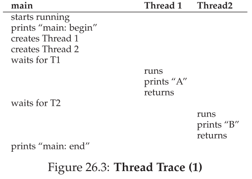
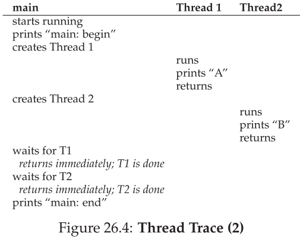

### Why It Gets Worse: Shared Data
we can nowlook at what each worker is trying to do: add a number to the shared variable counter, and do so 10 million times (1e7) in a loop. Thus, the desired final result is: 20,000,000.

We now compile and run the program, to see how it behaves. Sometimes, everything works how we might expect:

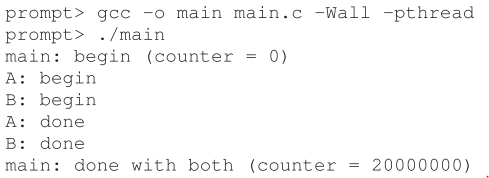

Unfortunately, when we run this code, even on a single processor, we
don’t necessarily get the desired result. Sometimes, we get:

Try one more time, we get:

### The Heart Of The Problem: Uncontrolled Scheduling
To understand why this happens, we must understand the code sequence that the compiler generates for the update to counter.  In this case, we wish to simply add a number (1) to counter.  Thus, the code sequence for doing so might look something like this (in x86);

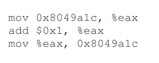

This example assumes that the variable counter is located at address 0x8049a1c.  In this three-instruction sequence, the x86 mov instruction is used first to get the memory value at the address and put it into register eax.  Then, the add is performed, adding 1 (0x1) to the contents of the eax register, and finally, the contents of eax are stored back into memory at the same address.

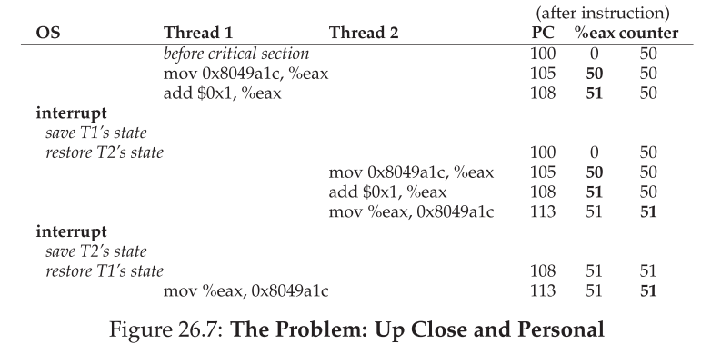

What we have demonstrated here is called a **race condition** (or, more specifically, a **data race**):  the results depend on the timing execution of the code.  With some bad luck (i.e.,  context switches that occur at untimely points in the execution), we get the wrong result. 

Because multiple threads executing this code can result in a race condition, we call this code a **critical section**.  A critical section is a piece of code that accesses a shared variable (or more generally, a shared resource) and must not be concurrently executed by more than one thread. What we really want for this code is what we call **mutual exclusion**. This property guarantees that if one thread is executing within the critical section, the others will be prevented fromdoing so.

## Locks
The name that the POSIX library uses for a lock is a mutex, as it is used to provide mutual exclusion between threads, i.e., if one thread is in the critical section, it excludes the others fromentering until it has completed the section.  

## Condition variables
In particular,  there are many cases where a thread wishes to check whether a condition is true before continuing its execution. For example, a parent thread might wish to check whether a child thread has completed before continuing (this is often called a join()); howshould such a wait be implemented? Let’s look at Figure 30.1.

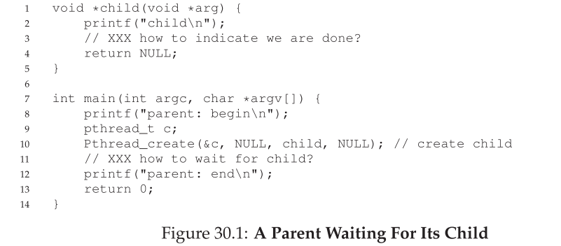

What we would like to see here is the following output:

We could try using a shared variable, as you see in Figure 30.2.  This solution will generally work, but it is hugely inefficient as the parent spins and wastes CPU time.  What we would like here instead is some way to put the parent to sleep until the condition we are waiting for (e.g., the child is done executing) comes true.

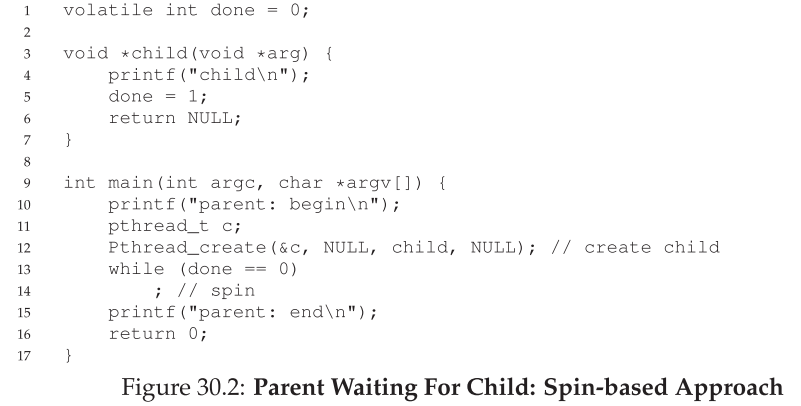

### Definition and Routines
To wait for a condition to become true, a thread can make use of what is known as a **condition variable**.  A **condition variable** is an explicit queue that threads can put themselves on when some state of execution (i.e.,  some condition) is not as desired (by **waiting** on the condition); some other thread,  when it changes said state,  can then wake one (or more) of those waiting threads and thus allow them to continue (by **signaling** on the condition).

We will often refer to these as wait() and signal() for simplicity. One thing you might notice about the wait() call is that it also takes a mutex as a parameter; it assumes that this mutex is locked when wait() is called.  The responsibility of wait() is to release the lock and put the calling thread to sleep (atomically); when the thread wakes up (after some other thread has signaled it), it must re-acquire the lock before returning to the caller.  

### The Producer/Consumer (Bounded Buffer) Problem

[Producer-consumer problem on wiki...](https://zh.wikipedia.org/wiki/%E7%94%9F%E4%BA%A7%E8%80%85%E6%B6%88%E8%B4%B9%E8%80%85%E9%97%AE%E9%A2%98)

Imagine one or more producer threads and one or more consumer threads.  Producers generate data items and place them in a buffer; consumers grab said items from the buffer and consume themin some way.

This arrangement occurs in many real systems.   For example,  in a multi-threaded web server, a producer puts HTTP requests into a work queue (i.e., the bounded buffer); consumer threads take requests out of this queue and process them.

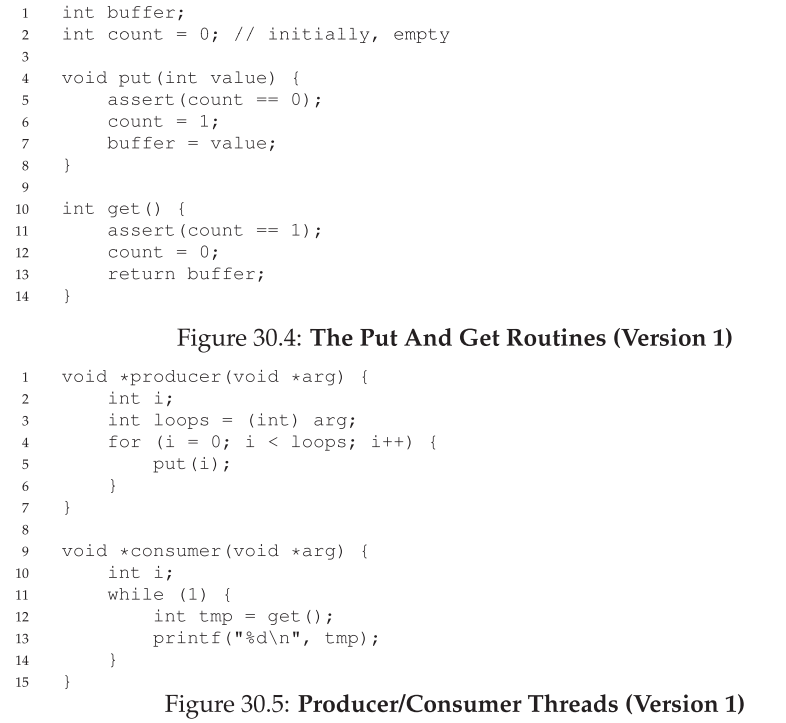

The first thing we need is a shared buffer, into which a producer puts data,  and out of which a consumer takes data.   Let’s just use a single integer for simplicity (you can certainly imagine placing a pointer to a data structure into this slot instead), and the two inner routines to put a value into the shared buffer, and to get a value out of the buffer.  See Figure 30.4 for details.

But if we write the synchronization code such that a producer puts data into a full buffer, or a consumer gets data from an empty one,  we have done something wrong (and in this code, an assertion will fire).

#### A Broken Solution
With just a single producer and a single consumer, the code in Figure 30.6 works.  However, if we have more than one of these threads (e.g., two consumers), the solution has two critical problems. What are they?

*pause and thinking...*

Fortunately, this fix is easy (Figure 30.8): change the if to a while.

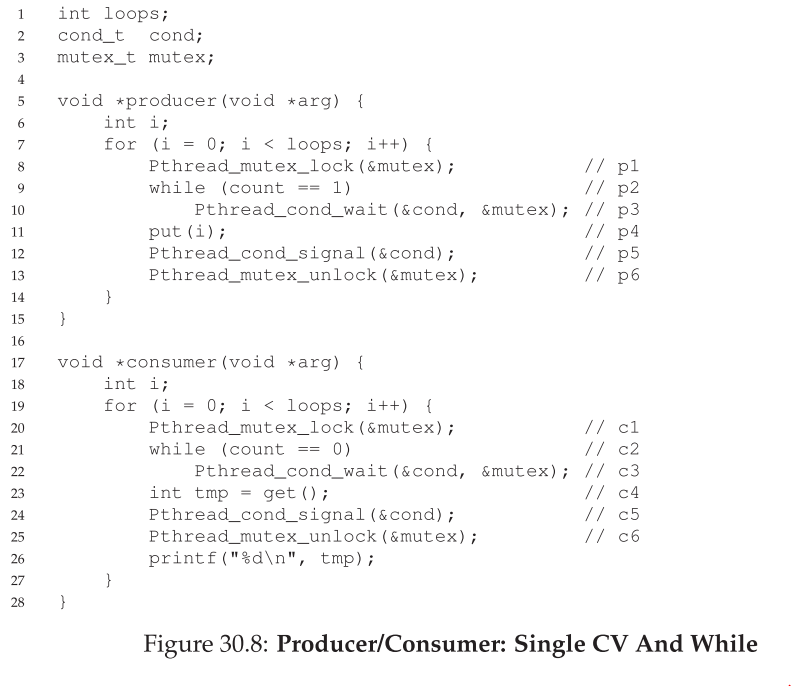

#### Better, But Still Broken
However, this code still has a bug, the second of two problems mentioned above.  Can you see it? It has something to do with the fact that there is only one condition variable.  

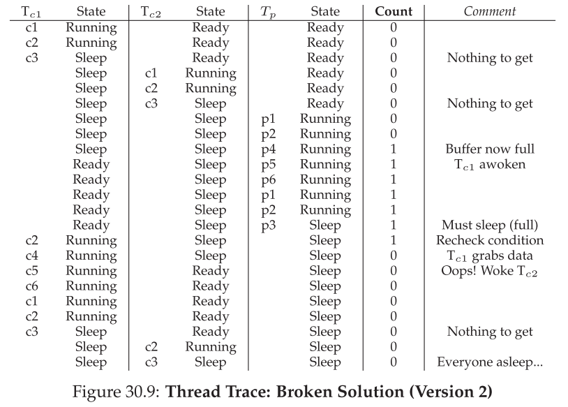

#### The Single Buffer Producer/Consumer Solution

#### The Correct Producer/Consumer Solution
We now have a working producer/consumer solution, albeit not a fully general one. The last change we make is to enable more concurrency and efficiency; specifically, we add more buffer slots, so that multiple values can be produced before sleeping,  and similarly multiple values can be consumed before sleeping.

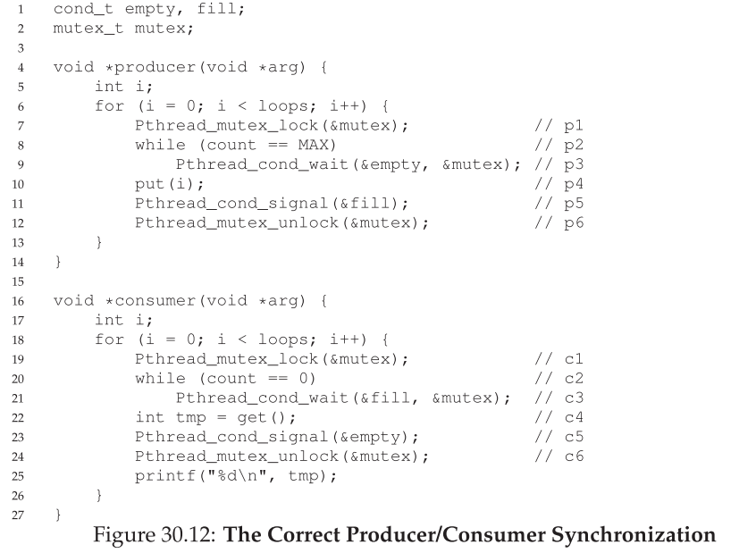

待續...

### 參考資料

STL threading: https://kheresy.wordpress.com/2012/07/06/multi-thread-programming-in-c-thread-p1/

operating system book: http://pages.cs.wisc.edu/~remzi/OSTEP/

event loop: http://www.ruanyifeng.com/blog/2013/10/event_loop.html