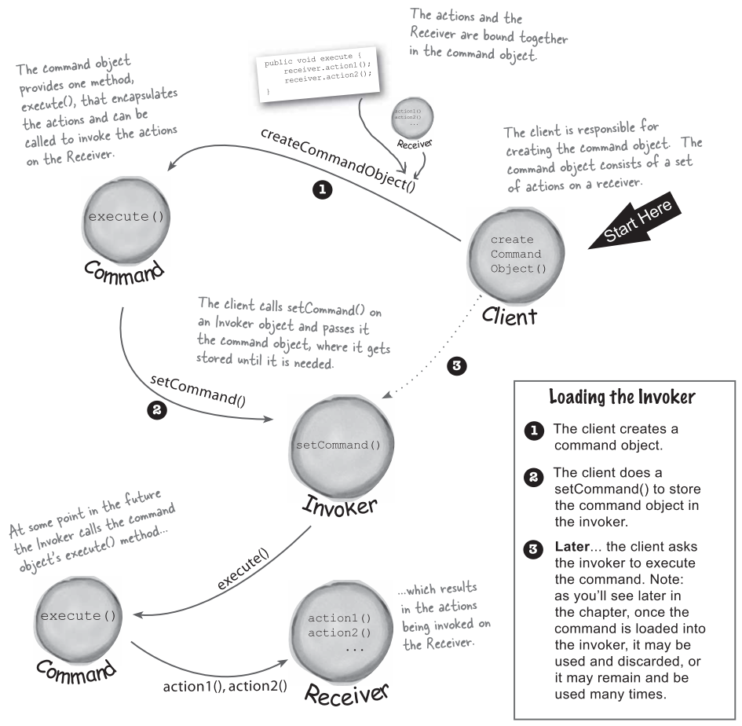
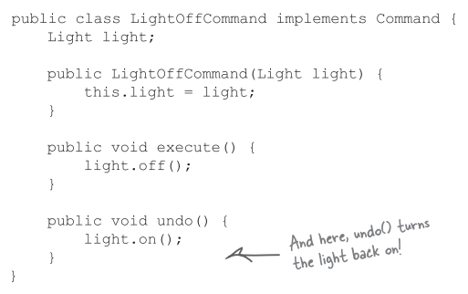
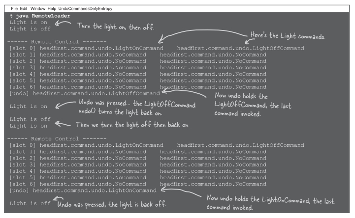
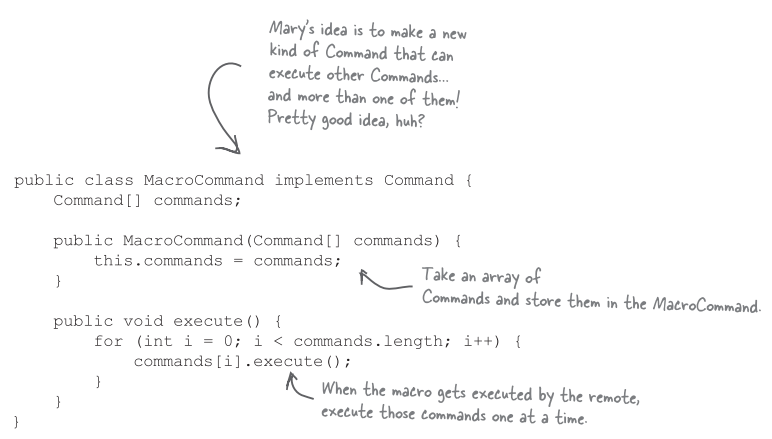

# Command pattern (命令模式)
我們想設計一個 API，供家電自動化的遙控器使用。這個遙控器具有七個可編程的插槽 (每個都可以指定到一個不同的家電裝置)，每個插槽都有對應的開關。這個遙控器還具備一個整體的復原按鈕。

### 讓我們來看看這個遙控器

### 看一下廠商的類別

### 討論如何設計這個遙控器
A: 我認為必須把它切割開: 遙控器應該知道如何解讀按鈕被按下的動作，然後發出正確的請求，但是遙控器不需知道這些家電自動化的細節，或者如何打開熱水器。

B: 有一個模式叫做 "命令模式"，他可以將 "動作的要求者" 從 "動作的執行者" 物件中鬆綁。在你們的例子中，要求者可以是遙控器，而執行者物件就是廠商類別其中之一的實體。

### 回到命令模式的簡單介紹
我們可以利用餐廳，藉由研究客戶，服務生，訂單，以及廚師之間的互動。藉由這樣的互動，可以體會到命令模式所牽涉到的物件，也會知道它們之間是如何被鬆綁。

大家可以看到，這間餐廳的服務生藉由訂單而和廚師之間鬆綁。

### 從餐廳回到命令模式

### 第一個命令物件

### 定義命令模式
命令模式將 "請求" 封裝成物件，以便使用不同的請求，佇列，或是日誌，參數化其他物件。命令模式也支援可復原的作業。

### 將命令指定到插槽

### 實踐遙控器

### 實踐命令

### 逐步測試遙控器

等等，怎麼會有 NoCommand，這是怎麼回事?

我們的確省略了一些東西。在遙控器中，我們不想檢查每次是否某個插槽都具有命令。比方說，在這個 `onButtonWasPushed()` 方法中，可能需要這樣的程式碼:

所以如何避免上面的作法? 我們可以實踐出一個不做事情的命令

這麼一來，在 `RemoteControl` 建構式中，將每個插槽都預先指定成 `NoCommand` 物件，以便確定每個插槽永遠都有命令物件。

### 加入 Undo 功能

### 測試 Undo 功能

### 每個遙控器應該具備 "巨集" 形式!
我們希望遙控器可以只按一個按鍵，就同時弄暗燈光，打開音響和電視，設定好 DVD。

### 使用巨集命令

### 命令模式的更多用途: 佇列請求
命令可以將運算包裝起來 (一個接收者和一組動作)，然後將它傳來傳去，就像一般的物件一樣。事實上，甚至可以在不同執行緒中被調用。我們可以利用這樣的特性衍生出一些應用。

例如: 排程器，執行緒池，以及工作佇列等...

想像一個工作佇列，在某一端加入新的命令，然後再另一端則是執行緒，執行緒從佇列中取出一個命令，`execute()` 完後丟棄。

利用命令模式，工作佇列類別和進行計算的物件之間完全是鬆綁的。此刻執行緒可能在進行財務運算，下一刻卻在讀取網路資料。工作佇列物件不在乎到底做些什麼，只知道取出命令物件，然後執行 `execute()`。

### 命令模式的更多用途: 日誌請求
某一些應用需要我們將所有的動作都記錄在日誌中，並能在系統當機之後，重新調用這些動作回復到之前的狀態。藉由新增兩個方法 (`store()`，`load()`)，命令模式就能支援這一點。

要怎麼做呢? 當我們執行命令的時候，將歷史紀錄儲存在磁碟中。一旦系統當機，就可以將命令物件重新載入，並一口氣依序調用這些物件的 `execute()`方法。

這種日誌方式對於遙控器來說不具有意義，然而，有許多應用會調用大型資料結構的動作，無法被快速的儲存。藉由使用紀錄日誌，我們可以將上次查核點 (check point) 之後的所有操作紀錄下來，如果系統出狀況，從查核點開始採用這些操作。對更高階的應用而言，這些技術可以被擴充採用交易機制 (transection)，也就是說，一整群操作必須全部進行完成，或者沒有進行任何操作。

