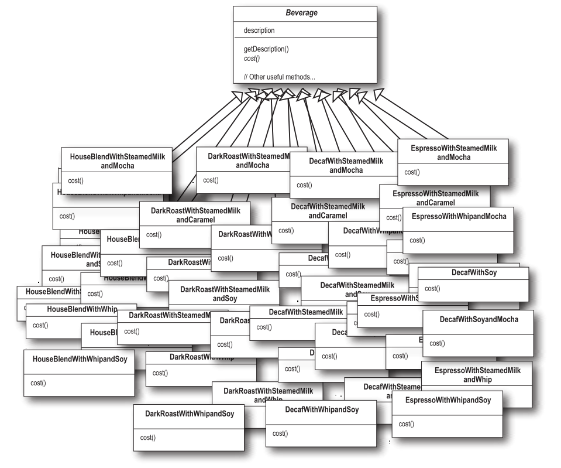

# 裝飾者模式 (Decorator pattern)

### 星巴克咖啡
我們設計一個訂單系統，原先的設計是這樣的:

購買咖啡時，也可以要求各種加料，例如:牛奶 (steamed milk), 豆漿 (soy), 摩卡 (mocha)。星巴克會根據加料斟酌收費，所以訂單系統設計上必須考慮加料的部分。

這是我們嘗試的第一個版本:

這設計顯然是笨透了，我們可以利用實體變數跟繼承，就可以追蹤這些配料了:

這樣仍然有一些設計上的問題:

- 配料價格改變會使得我們需要更改程式碼。
- 一旦出現新的配料，就需要加入新方法，並改變超類別中 `cost()` 對於配料價格的計算。
- 某些口味對某些飲料而言 (例如:冰茶)，配料可能不適合，但是 Tea (茶) 次類別仍將繼承某些不合適的方法，例如: `hasWhip()` (要加奶泡嗎)。
- 萬一顧客想要雙倍摩卡 (巧克力加兩倍) 咖啡，那怎麼辦?

#### 設計守則
類別應該對擴充開放; 應該對修改封閉。

我們的目標是允許類別容易擴充，在不修改既有程式碼的情況下，就可以搭配新的行為。這樣的設計具有彈性可以因應改變，可以接受新的功能已達到改變需求的目的。

### 認識裝飾者模式 (Decorator pattern)
在這裡我們要採用不一樣的作法:我們要以飲料為主體，然後在執行期以配料 "裝飾" (decorate) 飲料。比方說，如果顧客想要摩卡與奶泡的深度烘培咖啡:

1. 拿一個深度烘培咖啡 (DarkRoast) 物件。
2. 以摩卡 (Mocha) 物件裝飾。
3. 以奶泡 (Whip) 物件裝飾。
4. 呼叫 `cost()` 方法，將依賴委派 (delegate) 將配料的價格加上去。

### 目前得知的結論

- 裝飾者與被裝飾者有相同的超型態。
- 你可以利用一個或多個裝飾者包裝一個物件。
- 裝飾者與被裝飾者有相同的超型態，所以我們可以在任何需要傳遞原始的 (被包裝的) 物件的場合，改以傳遞裝飾後 (包裝的) 的物件。
- 裝飾者可以在所委派被裝飾者的行為，之前或之後加上自己的行為，達到特定目的。
- 物件可以在任何時候被裝飾，所以可以在執行期動態地用任何適合的裝飾者，來裝飾物件。

### 定義裝飾者模式
裝飾者模式動態地將責任加諸於物件上。若要擴充功能，裝飾者提供了比繼承更有彈性的選擇。

### 裝飾飲料

### 在繼承和合成之間，觀念有些混淆，討論解決問題

A: 我原本以為在此模式中不會使用到繼承，而是要利用合成取代繼承。

B: 的確是如此，但我認為，這麼做的重點是在於，裝飾者和被裝飾者必須是一樣的型態，也就是有共同的超類別。在這裡，我們利用繼承達到 "型態相符"，而非利用繼承取得相同的 "行為"。

A: 我知道為何裝飾者需要和被裝飾者有相同的介面，因為裝飾者必須能取代被裝飾者。但是行為又是何從而來 ?

B: 當我們將裝飾者與元件合成時，就是加入新行為。所得到的新行為，並非繼承自超類別，而是由合成物件得來的。

### 寫下程式碼

### Coding beverages

### Coding condiments

### Test result

### 真實世界的裝飾者: Java I/O
你已經到裝飾者模式了，這些 I/O 的相關類別，對你來說應該比較有意義了，因為其中許多類別都是裝飾者。下面是一個典型的物件集合，透過裝飾者來將功能結合起來，以讀取檔案。

