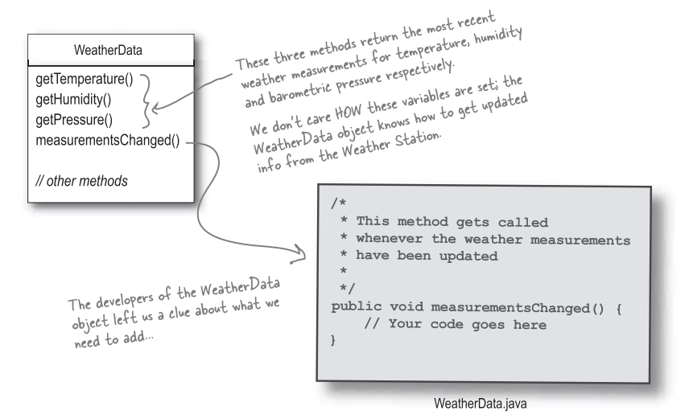
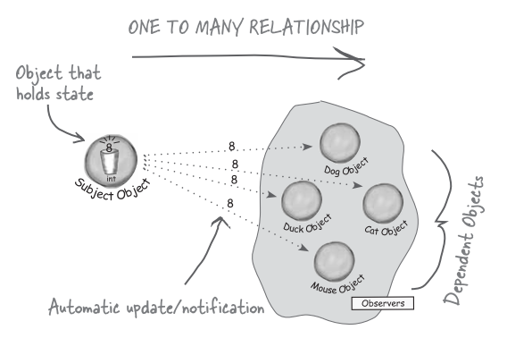

# 觀察者模式 (Observer pattern)

### 氣象監測系統
假設我們想做一個網路氣象站，然後必須建立在客戶提供的 WeatherData 物件上，他負責追蹤目前的天氣狀況。接著我們希望建立一個系統，有三個佈告欄，分別顯示目前狀況，氣象統計，以及簡單的預報。當 WeatherObject 物件向該系統要求最新數據時，資料必須即時更新。

而且這是一個可擴充的氣象站，氣象站可公佈一組 API，好讓其他程式員可以寫出自己的氣象佈告欄，並插入此系統中。

### 氣象監測系統的概況
此系統中的三個份子是氣象站，WeatherData 物件 (追蹤來自氣象站的資料，並顯示在佈告欄上)，以及佈告欄。

我們的工作就是建立一個系統，利用 WeatherData 物件，取得資料，並更新三個顯示佈告欄: 目前狀況，氣象統計，天氣預報。

### 瞧一瞧送到的 WeatherData 類別

我們的工作就是實踐 `measurementsChanged()`，好讓他更新目前狀況，氣象統計，天氣預報的顯示佈告欄。

### 先看一個錯誤的示範

### 我們的實踐有什麼不對?

我現在就來看看觀察者模式，然後再回來看看如何將此模式應用到氣象觀測站。

### 認識觀察者模式

**出版者 + 訂閱者 = 觀察者模式**

如果你了解報紙的訂閱是怎麼一回事，其實就知道觀察者模式是怎麼一回事，只是名稱不太一樣: 出版者改稱為 "主題" (Subject)，訂閱者改稱為觀察者 (Observer)。

### 觀察者模式運行範例

### 定義觀察者模式
觀察者模式定義了物件之間的一對多關係，如此一來，當一個物件改變狀態，其他相依者都會收到通知並自動更新。

### 觀察者模式類別圖

### 鬆綁的威力
觀察者提供了一種方式，讓主題和觀察者之間鬆綁。

當兩個物件之間被鬆綁，它們依然可以互動，但是不太清楚彼此的細節。

- 關於觀察者的一切，主題只知道觀察者有實踐特定介面 (也就是 Observer 介面)。
  - 主題不需要知道觀察者的具體類別為何，做了些什麼，還有其他細節。
- 任何時候都可以加入新的觀察者。
  - 事實上，在執行期我們可以用新的觀察者取代既有的觀察者，主題會讓這一切順暢運行。同樣的，可以在執行期動態地移除觀察者。
- 有新型態的觀察者出現時，主題的程式碼無須修改。
  - 若有新型態的觀察者出現時，只須讓新的觀察者實踐此觀察者介面，然後向主題註冊新觀察者即可。主題不在乎觀察者實際的類別為何，只在乎有沒有實踐觀察者介面。
- 我們可以在其他地方運用主題或觀察者，不必將兩著綁在一起。
- 片面地改變主題或觀察者，並不會影響另一方。

#### 設計守則
設計時，盡量讓需要互動的物件之間關係鬆綁。

### 回到設計氣象站

三個佈告欄的類別應該有一個指向 WeatherData 的 subject 指標，只是這裡沒畫上去，因為會太亂。

### 實踐氣象站

### 在 WeatherData 中實踐此主題介面

### 建立佈告欄

### 測試氣象站

### 執行程式

### 使用 Java 內建的觀察者模式

### Java 內建的觀察者模式如何運作
- 如何把物件變成觀察者
  - 使用 `deleteObserver()` 和 `addObserver()` 方法
- 觀察者要如何送出通知
  - 先呼叫 `setChanged()` 方法，標記狀態已改變的事實。
  - 然後呼叫 `notifyObservers()` 或是 `notifyObservers(Object arg)`。
- 觀察者如何收到通知
  - 跟以前一樣，只是方法的參數不太一樣: `update(Observerable o, Object arg)`。

### `setChanged()` 是怎麼一回事?
`setChanged()` 用來標示狀態已經改變的事實，好讓 `notifyObservers()` 知道應該更新觀察者。若呼叫 `notifyObservers()` 之前沒有先呼叫 `setChanged()`，觀察者就 "不會" 被通知，讓我們來看看 `Observerable` 內部，以了解這一切:

`setChanged()` 可以讓你在更新觀察者時，有更多的彈性。比方說，如果沒有 `setChanged()` 方法，由於氣象站量測很準確，以至於溫度計每十分之一度就會更新，這會造成 WeatherData 過度頻繁更新觀察者，我們不希望這樣的事情發生。如果我們希望差距在半度才更新，就可以在溫度差距達到半度時，呼叫 `setChanged()`，造成有效的更新。

### 利用內建的支援更改氣象站的程式

### 改版 `CurrentConditionsDisplay`

## C++ 內建支援觀察者模式嗎?
不支援，但是有些 C++ 函式庫利用觀察者模式實作出所謂 signal / slot 的機制:

- Qt Signal/Slot
- [Boost.Signals2](https://www.boost.org/doc/libs/1_61_0/doc/html/signals2.html#idp394519184)