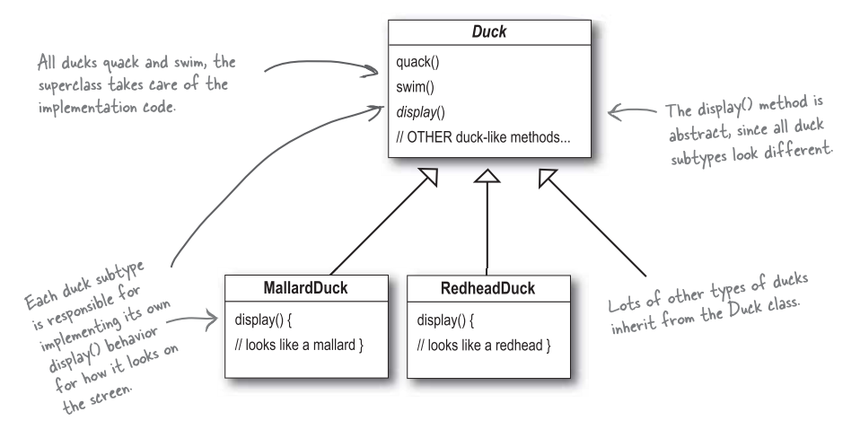
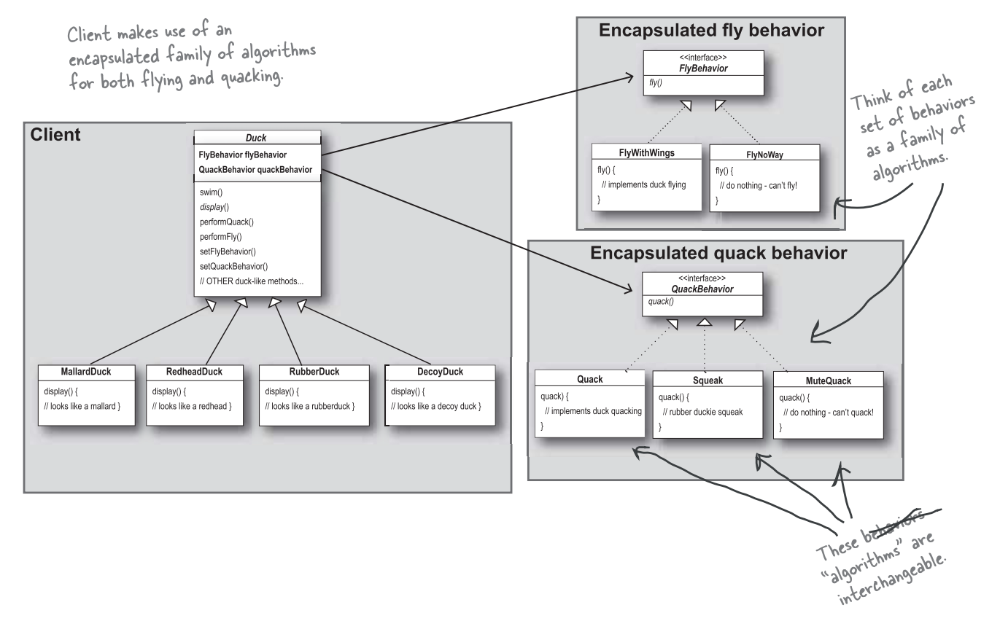

# Welcome to Design Pattern (設計模式)
**有些人已經解決你的問題了**，在本章，你將學習到如何利用其他開發者的經驗與智慧。他們遭遇過相同的問題，也順利的解決這些問題。

使用模式最好的方式是: 把模式記在腦子裡，然後你在設計或維護程式中，尋找何處可以使用這些模式。

### 先從簡單的模擬鴨子版本開始
Joe 的公司做了一套模擬鴨子遊戲 *SimUDuck*。

### 現在我們需要讓鴨子能飛
主管認為，此模擬程式需要會飛的鴨子，才可以贏過競爭者。

### 但是，可怕的事發生了
Joe 忽略一件事，並非所有 Duck 子類都會飛，這會使得某些子類別也具有不恰當的行為。

### Joe 想到方法
Joe: 我可以把 RubberDuck 類別中的 `fly()` 方法 override，就像 override `quack()` 的做法一樣。

可是，如果以後我加入 Decoy Duck 又會如何 ? Decoy Duck 是假鴨，不會飛也不會叫。

### 利用介面如何?
Joe 發現繼承不是一個很好的解決方法，因為他知道之後每六個月都會更新新產品，規格會常常改變，每當有新的鴨子子類別出現，他就要被迫檢視並可能要 override `fly()` 和 `quark()`... 這簡直是無窮無盡的惡夢。

所以，他需要一個更清晰的方法，讓 "某些" 鴨子型態可飛或可叫。

這顯然是個不好的主意，重複的程式碼會變多。想像一下假設你有 50 個 Duck 子類，今天你要稍微修改一下飛行的行為，那不就要修改很多次。

雖然 `Flyable` 與 `Quackable` 可以解決一部分的問題 (不會再有會飛的橡皮鴨)，但是卻造成程式碼無法再利用，這只能算是從一個惡夢跳到另一個惡夢。

## 軟體開發的一個不變真理

不管當初軟體設計的多好，總是需要成長與改變。否則軟體就會 "死亡" 。

### 把問題歸零
現在我們知道使用繼承有一些缺失，因為改變鴨子的行為會影響所有種類的鴨子，而這並不恰當。幸運的是有個設計守則，正式適用於此狀況。

#### 設計守則
找出程式中可能需要更動之處，把它們獨立出來，不要和那些不需要更動的程式碼混在一起。(與SRP相似)

換個角度說: "把會變動的部分取出並封裝起來，以便以後可以輕易地擴充此部分，而不影響不需要更動的其他部分"。(與OCP相似)

### 分開變動和不會變動的部分
我們知道 Duck 類別內的 `fly()` 和 `quack()` 會隨著鴨子不同而改變。

為了要把這兩個行為從鴨子中分開，我們將把它們自鴨子中取出，建立一組新類別代表每個行為。

### 設計鴨子的行為
我們希望一切有彈性，我們應該在鴨子類別中包含設定行為的方法，就可以在 "執行期" 動態地 "改變" 鴨子的飛行行為。

有了這些目標，接著看看第二個設計原則:

#### 設計原則
寫程式是針對介面而寫，而不是針對實踐方式而寫。 (與DIP相似)

我們利用介面代表每個行為，例如，FlyBehavior 與 QuackBehavior。

這樣的設計，可以讓飛行和叫聲的動作被其他的物件再三利用，因為這些行為已經與鴨子類別無關了。

而我們可以新增一些行為，不會影響到既有的行為，也不會影響有 "使用" 到飛行行為的鴨子類別。

### 整合鴨子的行為

實踐 `performQuack()`:

如何設定 `flyBehavior` 與 `quackBehavior`:

### 動態地設定行為
在鴨子類別裡建立了一堆動態的功能沒有用到，就太可惜了! 假設我們想在鴨子子類別透過 "setter method" 設定鴨子行為，而不是在鴨子的建構式內使用鴨子的行為。

在執行期想改變鴨子的行為，只要呼叫鴨子的 setter 方法就可以。

### 行為封裝的大局觀
下面是整個重新設計後的類別架構，也請注意，我們敘述事情的方式也稍有改變。不再把鴨子的行為說成 "一組行為"，我們開始把行為想成是 "一群演算法"。想想看，在 SimUDuck 的設計中，演算法代表鴨子能做的事，這樣的做法，似乎也能套用在別處。例如: 用一群實踐相同介面的類別，每個類別實踐不同的營業稅計算公式，就可以算出不同的稅金。

### "有一個 (Has a)" 可能比 "是一個 (Is a)" 更好
"有一個" 關係相當有趣: 每個鴨子都有一個 `FlyBehavior` 且有一個 `QuackBehavior`，讓鴨子將飛行和叫聲委託它們代為處理。

當你將兩個類別結合起來使用，如同本例一般，這就是合成物 (composition)。這種作法和 "繼承" 不同的地方在於，鴨子的行為不是繼承而來，而是和適當的行為物件 "合成" 而來。

這是一個很重要的設計原則。

#### 設計原則
多用合成，少用繼承。

如你所見，合成建立系統有很大的彈性，不僅可以將演算法封裝成類別，更可以 "在執行期間動態地改變行為"。

### 講到設計模式

我們剛剛用了第一個設計模式: 也就是策略模式 (Strategy Pattern)

#### 策略模式正式定義:
定義了演算法家族，個別封裝起來，讓他們之間可以互相替換，此模式讓演算法的變動，不會影響到使用演算法的程式。

### 設計模式的用處
設計模式讓你和其他的程式員之間有共通的語言，一旦懂這些詞彙，和其他程式員之間溝通這些觀念就很容易。設計模式也可以幫助你提升思考架構的層次到模式層面，而不是停留在瑣碎的物件上。