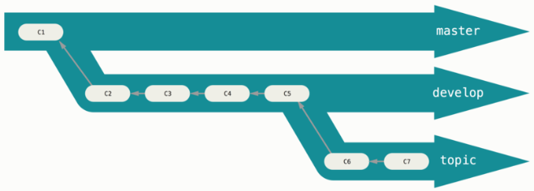
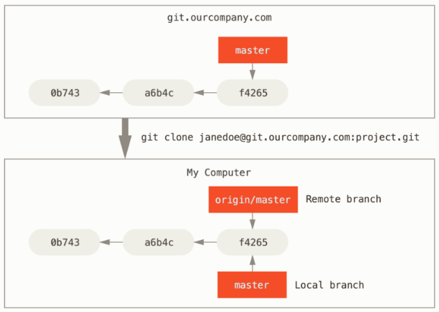
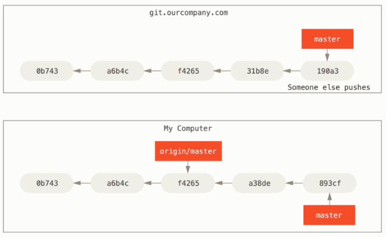
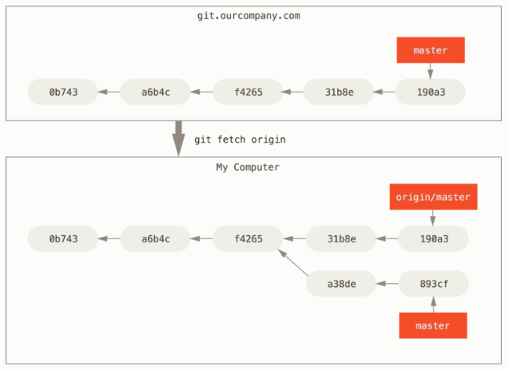
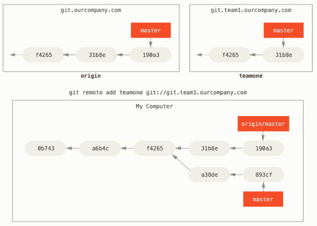
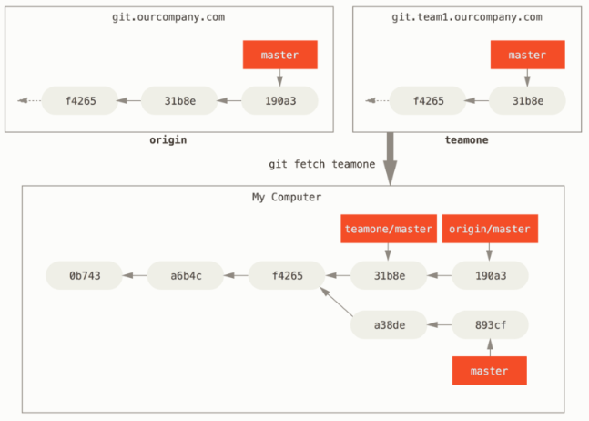

## 分支管理

`git branch` 命令不僅能建立和刪除分支， 如果不加任何參數，你將會得到所有分支的簡易清單：

```
$ git branch
  iss53
* master
  testing
```

注意 `master` 分支前面的 `*` 字元，它表示目前所檢出（`checkout`）的分支（換句話說，`HEAD` 指向這個分支）； 這意味著如果你現在提交，`master` 分支將隨之向前移動。 若要查看各個分支最後一個提交，執行 `git branch -v`：

```
$ git branch -v
  iss53   93b412c fix javascript issue
* master  7a98805 Merge branch 'iss53'
  testing 782fd34 add scott to the author list in the readmes
```

`--merged` 和 `--no-merged` 這兩個有用的選項，可以從該清單中篩選出已經合併或尚未合併到目前分支的分支。 使用 `git branch --merged` 來查看哪些分支已被合併到目前分支：

```
$ git branch --merged
  iss53
* master
```

查看所有包含未合併工作的分支，可以運行 `git branch --no-merged`：

```
$ git branch --no-merged
  testing
```

這顯示了你其它的分支； 由於它包含了還未合併的工作，嘗試使用 `git branch -d` 刪除該分支將會失敗

```
$ git branch -d testing
error: The branch 'testing' is not fully merged.
If you are sure you want to delete it, run 'git branch -D testing'.
```

可以用 -D 選項來強制執行。

## 分支工作流程



You can keep doing this for several levels of stability. Some larger projects also have a `proposed` or `pu` (proposed updates) branch that has integrated branches that may not be ready to go into the `next` or `master` branch. The idea is that your branches are at various levels of stability; when they reach a more stable level, they’re merged into the branch above them. Again, having multiple long-running branches isn’t necessary, but it’s often helpful, especially when you’re dealing with very large or complex projects.

## 遠端分支
Remote-tracking branches are references to the state of remote branches. They’re local references that you can’t move; they’re moved automatically for you whenever you do any network communication. Remote-tracking branches act as bookmarks to remind you where the branches in your remote repositories were the last time you connected to them.

Let’s look at an example. Let’s say you have a Git server on your network at `git.ourcompany.com`. If you clone from this, Git’s `clone` command automatically names it `origin` for you, pulls down all its data, creates a pointer to where its `master` branch is, and names it `origin/master` locally. Git also gives you your own local `master` branch starting at the same place as origin’s `master` branch, so you have something to work from.



If you do some work on your local `master` branch, and, in the meantime, someone else pushes to `git.ourcompany.com` and updates its `master` branch, then your histories move forward differently. Also, as long as you stay out of contact with your origin server, your `origin/master` pointer doesn’t move.



To synchronize your work, you run a `git fetch` origin command. This command looks up which server “origin” is (in this case, it’s `git.ourcompany.com`), fetches any data from it that you don’t yet have, and updates your local database, moving your `origin/master` pointer to its new, more up-to-date position.



To demonstrate having multiple remote servers and what remote branches for those remote projects look like, let’s assume you have another internal Git server that is used only for development by one of your sprint teams. This server is at `git.team1.ourcompany.com`. You can add it as a new remote reference to the project you’re currently working on by running the `git remote add` command as we covered in Git 基礎. Name this remote `teamone`, which will be your shortname for that whole URL.



Now, you can run `git fetch teamone` to fetch everything the remote `teamone` server has that you don’t have yet. Because that server has a subset of the data your `origin` server has right now, Git fetches no data but sets a remote-tracking branch called `teamone/master` to point to the commit that `teamone` has as its `master` branch.



### Pushing
When you want to share a branch with the world, you need to push it up to a remote that you have write access to. Your local branches aren’t automatically synchronized to the remotes you write to – you have to explicitly push the branches you want to share. That way, you can use private branches for work you don’t want to share, and push up only the topic branches you want to collaborate on.

If you have a branch named `serverfix` that you want to work on with others, you can push it up the same way you pushed your first branch. Run `git push <remote> <branch>`:

```
$ git push origin serverfix
Counting objects: 24, done.
Delta compression using up to 8 threads.
Compressing objects: 100% (15/15), done.
Writing objects: 100% (24/24), 1.91 KiB | 0 bytes/s, done.
Total 24 (delta 2), reused 0 (delta 0)
To https://github.com/schacon/simplegit
 * [new branch]      serverfix -> serverfix
```

You can also do `git push origin serverfix:serverfix`, which does the same thing – it says, “Take my serverfix and make it the remote’s serverfix.” You can use this format to push a local branch into a remote branch that is named differently. If you didn’t want it to be called `serverfix` on the remote, you could instead run `git push origin serverfix:awesomebranch` to push your local `serverfix` branch to the `awesomebranch` branch on the remote project.

---

The next time one of your collaborators fetches from the server, they will get a reference to where the server’s version of `serverfix` is under the remote branch `origin/serverfix`:

```
$ git fetch origin
remote: Counting objects: 7, done.
remote: Compressing objects: 100% (2/2), done.
remote: Total 3 (delta 0), reused 3 (delta 0)
Unpacking objects: 100% (3/3), done.
From https://github.com/schacon/simplegit
 * [new branch]      serverfix    -> origin/serverfix
```

It’s important to note that when you do a fetch that brings down new remote-tracking branches, you don’t automatically have local, editable copies of them. In other words, in this case, you don’t have a new `serverfix` branch – you only have an `origin/serverfix` pointer that you can’t modify.

To merge this work into your current working branch, you can run git merge `origin/serverfix`. If you want your own `serverfix` branch that you can work on, you can base it off your remote-tracking branch:

```
$ git checkout -b serverfix origin/serverfix
Branch serverfix set up to track remote branch serverfix from origin.
Switched to a new branch 'serverfix'
```

### Tracking Branches
Checking out a local branch from a remote-tracking branch automatically creates what is called a “tracking branch” (and the branch it tracks is called an “upstream branch”). Tracking branches are local branches that have a direct relationship to a remote branch. If you’re on a tracking branch and type `git pull`, Git automatically knows which server to fetch from and branch to merge into.

When you clone a repository, it generally automatically creates a `master` branch that tracks `origin/master`. However, you can set up other tracking branches if you wish – ones that track branches on other remotes, or don’t track the `master` branch. The simple case is the example you just saw, running `git checkout -b [branch] [remotename]/[branch]`. This is a common enough operation that git provides the `--track` shorthand:

```
$ git checkout --track origin/serverfix
Branch serverfix set up to track remote branch serverfix from origin.
Switched to a new branch 'serverfix'
```

In fact, this is so common that there’s even a shortcut for that shortcut. If the branch name you’re trying to checkout (a) doesn’t exist and (b) exactly matches a name on only one remote, Git will create a tracking branch for you:

```
$ git checkout serverfix
Branch serverfix set up to track remote branch serverfix from origin.
Switched to a new branch 'serverfix'
```

To set up a local branch with a different name than the remote branch, you can easily use the first version with a different local branch name:

```
$ git checkout -b sf origin/serverfix
Branch sf set up to track remote branch serverfix from origin.
Switched to a new branch 'sf'
```

Now, your local branch `sf` will automatically pull from `origin/serverfix`.

If you already have a local branch and want to set it to a remote branch you just pulled down, or want to change the upstream branch you’re tracking, you can use the `-u` or `--set-upstream-to` option to `git branch` to explicitly set it at any time.

```
$ git branch -u origin/serverfix
Branch serverfix set up to track remote branch serverfix from origin.
```

If you want to see what tracking branches you have set up, you can use the `-vv` option to `git branch`. This will list out your local branches with more information including what each branch is tracking and if your local branch is ahead, behind or both.

```
$ git branch -vv
  iss53     7e424c3 [origin/iss53: ahead 2] forgot the brackets
  master    1ae2a45 [origin/master] deploying index fix
* serverfix f8674d9 [teamone/server-fix-good: ahead 3, behind 1] this should do it
  testing   5ea463a trying something new
```

So here we can see that our `iss53` branch is tracking `origin/iss53` and is “ahead” by two, meaning that we have two commits locally that are not pushed to the server.

Next we can see that our `serverfix` branch is tracking the `server-fix-good` branch on our `teamone` server and is ahead by three and behind by one, meaning that there is one commit on the server we haven’t merged in yet and three commits locally that we haven’t pushed.

 If you want totally up to date ahead and behind numbers, you’ll need to fetch from all your remotes right before running this. You could do that like this: `git fetch --all`; `git branch -vv`

 ### Pulling
While the `git fetch` command will fetch down all the changes on the server that you don’t have yet, it will not modify your working directory at all. It will simply get the data for you and let you merge it yourself. However, there is a command called `git pull` which is essentially a `git fetch` immediately followed by a `git merge` in most cases.

Generally it’s better to simply use the `fetch` and `merge` commands explicitly as the magic of `git pull` can often be confusing.

### 刪除遠端分支
Suppose you’re done with a remote branch – say you and your collaborators are finished with a feature and have merged it into your remote’s `master` branch (or whatever branch your stable codeline is in). You can delete a remote branch using the `--delete` option to `git push`. If you want to delete your `serverfix` branch from the server, you run the following:

```
$ git push origin --delete serverfix
To https://github.com/schacon/simplegit
 - [deleted]         serverfix
```