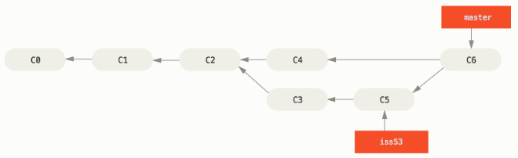

## 分支和合併的基本用法

讓我們來看一個你在現實生活中，有可能會用到的分支（branch）與合併（merge）工作流程的簡單範例， 你做了以下動作：

1. 開發一個網站。
2. 建立一個分支以實現一個新故事。
3. 在這個分支上進行開發。

此時你接到一個電話，有個很危急的問題需要緊急修正（hotfix）， 你可以按照下面的方式處理：

1. 切換到發佈產品用的分支。
2. 在同一個提交上建立一個新分支，在這個分支上修正問題。
3. 通過測試後，切回發佈產品用的分支，將修正用的分支合併進來，然後再推送（push）出去以發佈產品。

切換到之前實現新需求的分支以繼續工作。

### 分支基本用法
首先，我們假設你正在開發你的專案，並且已經有一些提交（commit）了。


無論你的公司使用的議題追蹤系統（issue-tracking system）是哪一套，你決定要修正其中的議題 #53； 要同時新建並切換到新分支，你可以在執行 `git checkout` 時加上 `-b` 選項：

```
$ git checkout -b iss53
Switched to a new branch "iss53"
```

它相當於下面這兩條命令：

```
$ git branch iss53
$ git checkout iss53
```


你開始開發網站，並做了一些提交； 因為你檢出（checkout）了這個分支（也就是 `HEAD` 指標正指向它），`iss53` 分支也隨之向前推進：

```
$ vim index.html
$ git commit -a -m 'added a new footer [issue 53]'
```


現在你接到電話，那個網站有一個問題需要立即修正； 有了 Git ，你就不用把你的緊急修正連同 `iss53` 尚未完成的內容一起部署（deploy）到正式環境；你也不用為了正確地套用修正而先花一大堆功夫回復之前 `iss53` 的修改； 唯一需要做的只是切換回發佈產品用的 `master` 分支。

```
$ git checkout master
Switched to branch 'master'
```

此時工作目錄中的內容和你在解決問題 #53 之前的內容一模一樣，你可以集中精力進行緊急修正了； 讓我們建立一個緊急修正用的分支來進行工作，直到完成它：

```
$ git checkout -b hotfix
Switched to a new branch 'hotfix'
$ vim index.html
$ git commit -a -m 'fixed the broken email address'
[hotfix 1fb7853] fixed the broken email address
 1 file changed, 2 insertions(+)
```


你可以跑一些測試以確保該修正是你想要的，然後切回 `master` 分支並把它合併進來，再部署到產品上； 用 `git merge` 命令來進行合併：

```
$ git checkout master
$ git merge hotfix
Updating f42c576..3a0874c
Fast-forward
 index.html | 2 ++
 1 file changed, 2 insertions(+)
```

注意合併時有一個「Fast-forward」字眼； 由於你要合併的分支 `hotfix` 所指向的提交 `C4` 直接超前了提交 `C2`，Git 於是簡單地把分支指標向前推進； 換句話說，如果想要合併的提交可以直接往回追溯歷史到目前所在的提交，Git 會因為沒有需要合併的工作而簡單地把指標向前推進——這就是所謂的「快進（fast-forward）」。


在那個超級重要的修正被部署以後，你準備要切回到之前被中斷而正在做的工作； 然而在那之前，你可以先刪除 `hotfix`，因為你不再需要它了——`master` 也指向相同的提交； 使用 `git branch` 的 `-d` 選項執行刪除操作：

```
$ git branch -d hotfix
Deleted branch hotfix (3a0874c).
```

現在你可以切回到之前用來解決議題 #53 且仍在進展中的分支以繼續工作：

```
$ git checkout iss53
Switched to branch "iss53"
$ vim index.html
$ git commit -a -m 'finished the new footer [issue 53]'
[iss53 ad82d7a] finished the new footer [issue 53]
1 file changed, 1 insertion(+)
```


### 合併基本用法
你已經完成了議題 #53 的工作，並準備好將它合併到 `master` 分支； 要完成這件事，你需要將 `iss53` 分支合併到 `master` 分支，實際操作和之前合併 `hotfix` 分支時差不多， 只需切回合併目的地的 `master` 分支，然後執行 `git merge` 命令:

```
$ git checkout master
Switched to branch 'master'
$ git merge iss53
Merge made by the 'recursive' strategy.
index.html |    1 +
1 file changed, 1 insertion(+)
```

這次的合併和之前合併 `hotfix` 的情況看起來有點不一樣； 在這種情況下，你的開發歷史是從一個較早的點便開始分離開來， 由於目前所在的提交（譯註：C4）並不是被合併的分支（譯註：`iss53`，它指向 C5）的直接祖先，Git 必需進行一些處理； 就此例而言，Git 會用兩個分支末端的快照（譯註：C4、C5）以及它們的共同祖先（譯註：C2）進行一次簡單的三方合併（three-way merge）。


不同於將分支指標向前推進，Git 會對三方合併後的結果產生一個新的快照，並自動建立一個指向這個快照的提交（譯註：C6）。 這個提交被稱為「合併提交（merge commit）」，特別的是它的親代（parent）超過一個（譯註：C4 和 C5）。



既然你的工作成果已經合併了，也就不再需要 `iss53` 分支了， 你可以在議題追蹤系統中關閉該議題，然後刪除這個分支：

```
$ git branch -d iss53
```

### 合併衝突的解法
有時候合併過程並不會如此順利， 如果在不同的分支中都修改了同一個檔案的同一部分，Git 就無法乾淨地合併它們； 如果你在解決議題 #53 的過程中修改了 `hotfix` 中也修改過的部分，將得到類似下面的「合併衝突」結果：

```
$ git merge iss53
Auto-merging index.html
CONFLICT (content): Merge conflict in index.html
Automatic merge failed; fix conflicts and then commit the result.
```

Git 沒有自動產生新的合併提交， 它會暫停下來等你解決（resolve）衝突； 在合併衝突發生後的任何時候，如果你要看看哪些檔案還沒有合併，可以使用 `git status`:

```
$ git status
On branch master
You have unmerged paths.
  (fix conflicts and run "git commit")

Unmerged paths:
  (use "git add <file>..." to mark resolution)

    both modified:      index.html

no changes added to commit (use "git add" and/or "git commit -a")
```

它會列出所有有合併衝突且仍未解決的檔案（譯註：列在 `Unmerged paths`: 下面）； Git 會在有衝突的檔案裡加入標準的「衝突解決（conflict-resolution）」標記，因此你可以手動開啟它們以解決這些衝突； 你的檔案會包含類似下面這樣子的區段：

```
<<<<<<< HEAD:index.html
<div id="footer">contact : email.support@github.com</div>
=======
<div id="footer">
 please contact us at support@github.com
</div>
>>>>>>> iss53:index.html
```

可以看到 `=======` 隔開的上半部分是 `HEAD`（即 `master` 分支，在執行合併命令前所切換過去的分支）中的內容，下半部分則是在 `iss53` 分支中的內容； 解決衝突的辦法無非是二選一，或者由你自己合併內容； 比如你可以把這整段內容替換成以下內容而解決這個衝突：

```
<div id="footer">
please contact us at email.support@github.com
</div>
```

在解決了每個衝突檔案裡的每個衝突後，對每個檔案執行 `git add` 會將它們標記為已解決狀態， 因為預存（stage）動作代表了衝突已經解決。你可以再次執行 git status 來確認所有衝突都已經解決：

```
$ git status
On branch master
All conflicts fixed but you are still merging.
  (use "git commit" to conclude merge)

Changes to be committed:

    modified:   index.html
```

如果你滿意這個結果，並且確認了所有衝突都已經解決也預存了，就可以用 git commit 來完成這次合併提交；


