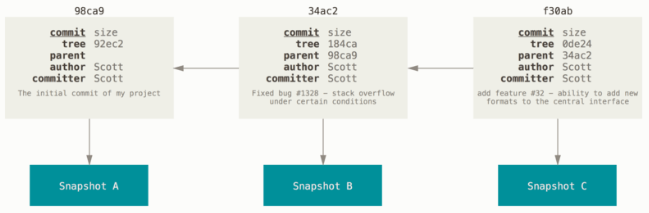
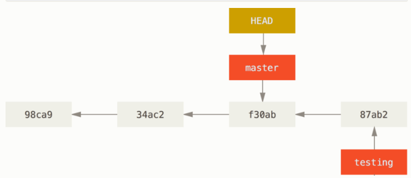

## 分支
為了具體說明，讓我們假設你有一個目錄包含了三個檔案，當使用 git commit 建立一個提交時，Git 會先計算每一個子目錄（本例中則只有專案根目錄）的雜湊值，然後在 Git 版本庫中將這些目錄記錄為樹（tree）物件； 之後 Git 建立提交物件，它除了包含相關提交資訊以外，還包含著指向專案根目錄的樹物件指標，如此它就可以在需要的時候重建此次快照內容。

你的 Git 版本庫現在有五個物件：三個 blob 物件用來儲存檔案內容、一個樹物件用來列出目錄的內容並紀錄各個檔案所對應的 blob 物件、一個提交用來記錄根目錄的樹物件和其他提交資訊。


如果你做一些修改並再次提交，這次的提交會再包含一個指向上次提交的指標:



Git 分支其實只是一個指向某提交的可移動輕量級指標， Git 預設分支名稱是 `master`， 隨著不斷地製作提交，`master` 分支會為你一直指向最後一個提交， 它在每次提交的時候都會自動向前移動。


### 建立一個新的分支
建立一個新分支會發生什麼事呢？ 答案很簡單，建立一個新的、可移動的指標； 比如新建一個 testing 分支， 可以使用 `git branch` 命令：

```
$ git branch testing
```

這會在目前提交上新建一個指標。


Git 如何知道你目前在哪個分支上工作的呢？ 其實它保存了一個名為 `HEAD` 的特別指標；在 Git 中，它就是一個指向你正在工作中的本地分支的指標（譯注：`HEAD` 等於「目前的」）， 所以在這個例子中，你仍然在 `master` 分支上工作； 執行 `git branch` 命令，只是「建立」一個新的分支——它並不會切換到這個分支。


你可以很輕鬆地看到分支指標指向何處，只需透過一個簡單的 `git log` 命令， 加上 `--decorate` 選項。

```
$ git log --oneline --decorate
f30ab (HEAD -> master, testing) add feature #32 - ability to add new formats to the central interface
34ac2 Fixed bug #1328 - stack overflow under certain conditions
98ca9 The initial commit of my project
```

### 在分支之間切換
要切換到一個已經存在的分支，你可以執行 `git checkout` 命令， 讓我們切換到新的 `testing` 分支：

```
$ git checkout testing
```

這會移動 `HEAD` 並指向 `testing` 分支。


這樣做有什麼意義呢？ 好吧！讓我們再提交一次：


非常有趣，現在 `testing` 分支向前移動了，而 `master` 分支仍然指向當初在執行 `git checkout` 時所在的提交， 讓我們切回 `master` 分支看看：



這條命令做了兩件事， 它把 HEAD 指標移回去並指向 `master` 分支，然後把工作目錄中的檔案換成 `master` 分支所指向的快照內容； 也就是說，現在開始所做的改動，將基於專案中較舊的版本，然後與其它提交歷史分離開來； 它實際上是取消你在 `testing` 分支裡所做的修改，這樣你就可以往不同方向前進。

#### 筆記
當你在 Git 切換分支時，如果 Git 無法很乾淨地切換過去，它就不會讓你切換過去。

---

讓我們做一些修改並再次提交：

現在你的專案歷史開始分離了； 你建立並切換到新分支，在上面進行了一些工作，然後切換回到主分支進行了另外一些工作， 雙方的改變分別隔離在不同的分支裡：你可以在不同分支裡反覆切換，並在時機成熟時把它們合併到一起； 而所有這些工作只需要簡單的 `branch`、`checkout`、`commit` 命令。


由於 Git 分支實際上只是一個檔案，該檔案內容是這個分支指向的提交的雜湊值（40 個字元長度的 SHA-1 字串），所以建立和銷毀一個分支就變得非常廉價； 新建一個分支就是向一個檔寫入 41 個位元組（40 個字元外加一個換行符號）那樣地簡單和快速。
