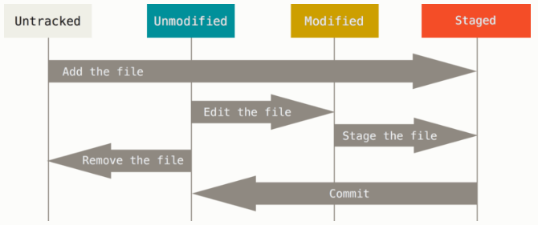

## 取得一個倉儲 (repository)
你有兩種主要方法來取得一個 Git 倉儲。 第一種是將現有的專案或者資料夾匯入 Git； 第二種是從其它伺服器克隆（clone）一份現有的 Git 倉儲。

### 在現有資料夾中初始化倉儲

若你打算使用 Git 來追蹤（track）現有的專案，只需要進入該專案的資料夾並執行：

`$ git init`

這個命令將會建立一個名為 `.git` 的子資料夾，其中包含 Git 所有必需的倉儲檔案，也就是 Git 倉儲的骨架。 到現在這步驟為止，倉儲預設沒有追蹤任何檔案。 

接下來你可以通過多次 `git add` 指令來追蹤完所有你想要追蹤的檔案，然後執行 `git commit` 提交：

```
$ git add *.c
$ git add LICENSE
$ git commit -m 'initial project version'
```

### 克隆現有的倉儲
克隆倉庫的命令格式是 `git clone [url]`。 例如：若你想克隆名為 libgit2 的 Git linkable library，可以執行下列命令：

```
$ git clone https://github.com/libgit2/libgit2
```

## 紀錄變更到版本庫中
現在你的手上有了一個貨真價實的 Git 版本庫和這個專案中所有檔案的檢出（checkout）或工作複本（working copy）， 每當你修改檔案到一個你想記錄它的階段時，你就需要提交（commit）這些變更的快照到版本庫中。

請記住，你工作目錄下的每個檔案不外乎兩種狀態：已追蹤、未追蹤。「已追蹤」檔案是指那些在上次快照中的檔案：它們的狀態可能是「未修改」、「已修改」、「已預存（staged）」； 「未追蹤」則是其它以外的檔案——在工作目錄中，卻不包含在上次的快照中，也不在預存區（staging area）中的任何檔案； 當你第一次克隆（clone）一個版本庫時，所有檔案都是「已追蹤」且「未修改」，因為 Git 剛剛檢出它們並且你尚未編輯過任何檔案。

隨著你編輯某些檔案，Git 會視它們為「已修改」，因為自從上次提交以來你已經更動過它們； 你預存（stage）這些已修改檔案，然後提交所有已預存的修改內容，接著重覆這個循環。



### 檢查你的檔案狀態
git status 命令是用來偵測哪些檔案處在什麼樣的狀態下的主要工具； 如果你在克隆之後直接執行該命令，應該會看到類似以下內容：

```
$ git status
On branch master
Your branch is up-to-date with 'origin/master'.
nothing to commit, working directory clean
```

這意味著你有一個乾淨的工作目錄——換句話說，已追蹤的檔案沒有被修改； Git 也沒有看到任何未追蹤檔案，否則它們會在這裡被列出來； 

假設你在專案中新增一個檔案，例如：一個簡單的 `README` 檔案； 如果該檔案先前並不存在，執行 `git status` 命令後，你會看到未追蹤檔案：

```
$ echo 'My Project' > README
$ git status
On branch master
Your branch is up-to-date with 'origin/master'.
Untracked files:
  (use "git add <file>..." to include in what will be committed)

    README

nothing added to commit but untracked files present (use "git add" to track)
```

你可以看到新增檔案 README 尚未被追蹤，因為它被列在輸出訊息的「Untracked files」欄位下方； 基本上「未追蹤」表示 Git 發現這個檔案在上次的快照（提交）中並不存在；Git 並不會將此檔案納入你的提交快照，除非你明確地告訴 Git 要這麼做；

### 追蹤新的檔案
要開始追蹤一個新的檔案，可以使用 `git add` 命令； 要開始追蹤 README 檔案，你可以執行：

```
$ git add README
```

如果再次執行檢查狀態命令

```
$ git status
On branch master
Your branch is up-to-date with 'origin/master'.
Changes to be committed:
  (use "git reset HEAD <file>..." to unstage)

    new file:   README
```
由於它放在「Changes to be committed」欄位下方，你可以得知它已經被預存， 如果你在此時提交，在執行 `git add` 的當下所加進來的檔案版本就會被記錄在歷史快照中；

### 預存修改過的檔案
讓我們修改一個已追蹤檔案； 假設你修改了一個先前已追蹤的檔案 `CONTRIBUTING.md`，接著再次執行 `git status`，你會看到類似以下文字：

```
$ git status
On branch master
Your branch is up-to-date with 'origin/master'.
Changes to be committed:
  (use "git reset HEAD <file>..." to unstage)

    new file:   README

Changes not staged for commit:
  (use "git add <file>..." to update what will be committed)
  (use "git checkout -- <file>..." to discard changes in working directory)

    modified:   CONTRIBUTING.md
```

`CONTRIBUTING.md` 檔案出現在「Changes not staged for commit」欄位下方——代表著位於工作目錄的已追蹤檔案已經被修改，但尚未預存；要預存該檔案，你可執行 `git add` 命令； `git add` 是一個多重用途的指令——用來「開始追蹤」檔案、「預存」檔案以及做一些其它的事。 現在，讓我們執行 `git add` 將 `CONTRIBUTING.md` 檔案預存起來，並再度執行 `git status`：

```
$ git add CONTRIBUTING.md
$ git status
On branch master
Your branch is up-to-date with 'origin/master'.
Changes to be committed:
  (use "git reset HEAD <file>..." to unstage)

    new file:   README
    modified:   CONTRIBUTING.md
```

這兩個檔案目前都被預存，而且將會成為你下次提交的內容； 此時，假設在提交前你想起要對 CONTRIBUTING.md 再做一個小修改，然後，當我們再次執行 git status：

```
$ vim CONTRIBUTING.md
$ git status
On branch master
Your branch is up-to-date with 'origin/master'.
Changes to be committed:
  (use "git reset HEAD <file>..." to unstage)

    new file:   README
    modified:   CONTRIBUTING.md

Changes not staged for commit:
  (use "git add <file>..." to update what will be committed)
  (use "git checkout -- <file>..." to discard changes in working directory)

    modified:   CONTRIBUTING.md
```

見鬼了？ 現在 CONTRIBUTING.md 同時被列在已預存「及」未預存。 這怎麼可能？ 原來 Git 在你執行 git add 命令時，的確將當時的檔案內容預存起來； 如果你現在提交，最後一次執行 git add 命令時，那個當下的 CONTRIBUTING.md 的版本會被提交，而不是在提交時你在工作目錄所看到的檔案版本被提交； 如果你在 git add 後修改檔案，你必需再次執行 git add 預存最新版的檔案：

```
$ git add CONTRIBUTING.md
$ git status
On branch master
Your branch is up-to-date with 'origin/master'.
Changes to be committed:
  (use "git reset HEAD <file>..." to unstage)

    new file:   README
    modified:   CONTRIBUTING.md
```

### 簡潔的狀態輸出
雖然 `git status` 輸出內容相當全面，但也相當囉嗦； Git 另外提供一個簡潔輸出的選項，因此你可以以一種較精簡的方式來檢視你的修改； 如果你執行 `git status -s` 或 `git status --short`，你可以從該命令得到一個相當簡單的輸出內容：

```
$ git status -s
 M README
MM Rakefile
A  lib/git.rb
M  lib/simplegit.rb
?? LICENSE.txt
```

未追蹤的新檔案在開頭被標示為 `??`、被加入預存區的新檔案被標為 `A`、已修改檔案則是 `M` 等等。 標記有二個欄位——左邊欄位用來指示「預存區」狀態，右邊欄位則是「工作目錄」狀態。 所以在這個範例中，在工作目錄中的檔案 `README` 是已修改的，但尚未被預存；而 `lib/simplegit.rb` 檔案則是已修改且已預存的； `Rakefile` 則是曾經修改過也預存過，但之後又再次修改，所以總共有二次修改，一個有預存一個沒有。

### 忽略不需要的檔案
通常你會有一類檔案不想讓 Git 自動加入，也不希望它們被顯示為未追蹤， 這些通常是自動產生的檔案，例如：日誌檔案或者編譯系統產生的檔案； 在這情況下，你可以新建一個名為 `.gitignore` 的檔案，在該檔中列舉符合這些檔名的模式（pattern）。 以下是一個 `.gitignore` 範例檔內容：

```
$ cat .gitignore
*.[oa]
*~
```
第一列告訴 Git 忽略任何副檔名為「.o」或「.a」的檔案，它們可能是編譯系統建置程式碼時所產生的目的檔及連結檔； 第二列告訴 Git 忽略所有檔名以波浪號（~）結尾的檔案。

編寫 `.gitignore` 檔案的模式規則如下：
- 空白列，或者以 # 開頭的列會被忽略。
- 可使用標準的 Glob 模式。
- 以斜線（/）開頭以避免路徑遞迴。（譯注：只忽略特定路徑；如果不以斜線開頭，則不管同名檔案或同名資料夾在哪一層都會被忽略。）
- 以斜線（/）結尾代表是目錄。
- 以驚嘆號（!）開頭表示將模式規則反向。
  
Glob 模式就像是 Shell 所使用的簡化版正規運算式（regular expressions），以下是另一個 `.gitignore` 範例檔案：

```
# 不要追蹤檔名為 .a 結尾的檔案
*.a

# 但是要追蹤 lib.a，即使上面已指定忽略所有的 .a 檔案
!lib.a

# 只忽略根目錄下的 TODO 檔案，不包含子目錄下的 TODO
/TODO

# 忽略 build/ 目錄下所有檔案
build/

# 忽略 doc/notes.txt，但不包含 doc/server/arch.txt
doc/*.txt

# 忽略所有在 doc/ 目錄底下的 .pdf 檔案
doc/**/*.pdf
```

#### 提示
如果你的專案想要有個好開頭，GitHub 在 https://github.com/github/gitignore 中針對幾十種專案和程式語言維護了一個相當完整、好用的 `.gitignore` 範例檔案列表。

### 檢視已預存及未預存的檔案
如果 `git status` 命令提供的資訊對你來說太過簡略——你要想精確地知道你修改了什麼，而不只是那些檔案被修改——你可以使用 `git diff` 命令。

假設你再次編輯並預存 `README` 檔案，接著修改 `CONTRIBUTING.md` 檔案卻未預存它， 如果你執行 `git status` 命令，你會再次看到類似以下資訊：

```
$ git status
On branch master
Your branch is up-to-date with 'origin/master'.
Changes to be committed:
  (use "git reset HEAD <file>..." to unstage)

    modified:   README

Changes not staged for commit:
  (use "git add <file>..." to update what will be committed)
  (use "git checkout -- <file>..." to discard changes in working directory)

    modified:   CONTRIBUTING.md
```

想瞭解尚未預存的修改，輸入不帶其它參數的 `git diff`：

```
$ git diff
diff --git a/CONTRIBUTING.md b/CONTRIBUTING.md
index 8ebb991..643e24f 100644
--- a/CONTRIBUTING.md
+++ b/CONTRIBUTING.md
@@ -65,7 +65,8 @@ branch directly, things can get messy.
 Please include a nice description of your changes when you submit your PR;
 if we have to read the whole diff to figure out why you're contributing
 in the first place, you're less likely to get feedback and have your change
-merged in.
+merged in. Also, split your changes into comprehensive chunks if your patch is
+longer than a dozen lines.

 If you are starting to work on a particular area, feel free to submit a PR
 that highlights your work in progress (and note in the PR title that it's
```

這命令會比對「工作目錄」和「預存區」之間的版本， 然後顯示尚未被存入預存區的修改內容。

如果你想檢視你已經預存而接下來將會被提交的內容，可以使用 `git diff --staged`； 這個命令比對的對象是「預存區」和「最後一次提交」。

```
$ git diff --staged
diff --git a/README b/README
new file mode 100644
index 0000000..03902a1
--- /dev/null
+++ b/README
@@ -0,0 +1 @@
+My Project
```

很重要且需要注意的一點是 `git diff` 不會顯示最後一次提交後的所有變更——只會顯示未預存的變更； 這會讓人困惑，因為如果你預存了所有的變更，`git diff` 不會輸出任何內容。

### 提交你的修改
在目前情況下，假設你上次執行 `git status` 時，你看到所有檔案都已經被預存，因此你準備提交你的變更。 最簡單的提交方式是輸入 `git commit`：

```
$ git commit
```

這麼做會啟動你選定的編輯器，編輯完 `commit` 內容過後，當你關閉編輯器，Git 會利用這些提交訊息（註解和差異內容會被濾除）產生新的提交。

另一種方式則是在 `commit` 命令的 `-m` 選項後方直接輸入提交訊息，如下：

```
$ git commit -m "Story 182: Fix benchmarks for speed"
[master 463dc4f] Story 182: Fix benchmarks for speed
 2 files changed, 2 insertions(+)
 create mode 100644 README
```
現在你已經建立了你的第一個提交！ 你可從輸出訊息看到此提交相關資訊：提交到哪個分支（master）、提交的 SHA-1 校驗碼（`463dc4f`）、有多少檔案被更動，以及統計此提交有多少列被新增和被移除。

### 略過預存區
Git 提供了一個簡易的捷徑， 在 `git commit` 命令加上 `-a` 選項，使 Git 在提交前自動預存所有已追蹤的檔案，讓你略過 `git add` 步驟

### 移除檔案
要從 Git 中刪除一個檔案，你需要將它從已追蹤檔案中移除（更準確地說，是從預存區中移除），然後再提交； `git rm` 命令可完成此工作，它同時也會將該檔案從工作目錄中移除，如此它之後也不會身為未追蹤檔案而被你看到。

如果你僅僅是將檔案從工作目錄中移除，那麼它會被列在 `git status` 輸出內容的「Changed but not updated」（也就是「未預存」）欄位下面：
```
$ rm PROJECTS.md
$ git status
On branch master
Your branch is up-to-date with 'origin/master'.
Changes not staged for commit:
  (use "git add/rm <file>..." to update what will be committed)
  (use "git checkout -- <file>..." to discard changes in working directory)

        deleted:    PROJECTS.md

no changes added to commit (use "git add" and/or "git commit -a")
```

如果你接著執行 `git rm`，它會預存該檔案的移除動作：

```
$ git rm PROJECTS.md
rm 'PROJECTS.md'
$ git status
On branch master
Your branch is up-to-date with 'origin/master'.
Changes to be committed:
  (use "git reset HEAD <file>..." to unstage)

    deleted:    PROJECTS.md
```

下一次提交時，該檔案將會消失而且不再被追蹤； 如果你修改了檔案且已經把修改內容加入索引中（譯注：「加入索引」和「預存」是同義詞），你必需使用 `-f` 選項才能強制將它移除； 這是一種為了避免已記錄的快照意外被移除後再也無法使用 Git 復原的保護機制。

另一個有用的技巧是保留工作目錄的檔案，但將它從預存區中移除； 換句話說，你或許想保留在磁碟機上的檔案但不希望 Git 再繼續追蹤它； 當你忘記將某些檔案加到 `.gitignore` 中而且不小心預存它的時候會特別用有，像是不小心預存了一個大的日誌檔案或者一堆 .a 已編譯檔案。 加上 `--cached` 選項可做到這件事：

```
$ git rm --cached README
```

### 移動檔案
Git 不像其它 VCS 系統，它並不會明確地追蹤檔案的移動； 如果你在 Git 中重新命名一個檔案，並不會有任何 Git 後設資料記錄這個動作以辨別你曾經重新命名過檔案； 然而 Git 可以在檔案移動後很聰明地將它們找出來——我們稍後會對偵測檔案的移動再多做一點說明。

因此 Git 有一個 mv 命令反而有點令人困惑； 如果你想要在 Git 中重新命名一個檔案，你可以執行以下命令：

```
$ git mv file_from file_to
```

事實上，如果你執行類似以下的動作然後檢視一下狀態，你將看到 Git 將該檔案視為一個重新命名過的檔案：

```
$ git mv README.md README
$ git status
On branch master
Your branch is up-to-date with 'origin/master'.
Changes to be committed:
  (use "git reset HEAD <file>..." to unstage)

    renamed:    README.md -> README
```

其實，它相當於執行下列命令：

```
$ mv README.md README
$ git rm README.md
$ git add README
```