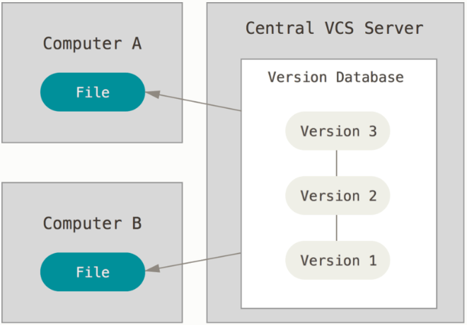

# Getting Started

## 關於版本控制

### 本地端版本控制
其中最流行的一種叫做 RCS，至今許多電腦上都還可以找到他的蹤影。 甚至在流行的 Mac OS X 系統中，只要安裝了開發者工具包以後，你就會有 rcs 的指令可以使用。 RCS 的工作原理是在硬碟上保存一堆特殊格式的補丁集合（patch set，即檔案從一個版本變更到另一個版本所需資訊）；通過套用任意的補丁，便可以重新產生出每個版本的檔案內容。

### 集中式版本控制系統
接下來人們又遇到了重大問題，就是如何和其他電腦上的開發者協同合作？ 為了解決這個問題，於是集中化的版本控制系統應運而生。

相對於本機版本控制系統，這種做法帶來了許多好處。 舉例來說，每個人都可以一定程度的知道專案中的其他人正在做些什麼。 管理員也可以輕鬆掌控每個開發者的權限。

然而，集中化的版本控制系統也有一些嚴重的缺點。 最嚴重的當然是中央伺服器如果發生故障的時候。 如果當機一小時，那麼這個小時之中，沒有人可以提交更新，也就無法協同合作。 

### 分散式版本控制系統
於是分散式版本控制系統（Distributed Version Control Systems，簡稱 DCCSs）就此登上舞台。 在 DVCS 系統（如 Git、Mercurial、Bazaar 和 Darcs）中，用戶端並不只取出最新的檔案快照；還把整個倉儲做個鏡像。 假設有任何一個協同合作的伺服器故障，事後都可以用任何一個用戶端的鏡像來還原。 因為每個地方都有完整的資料備份。

## Git 基礎要點

### 記錄檔案快照，而不是差異
Git 與其它版本控制系統（包含 Subversion 以及與它相關的）最主要的差別是如何處理資料的方式。 一般來說，其他大部分的系統是紀錄一連串檔案更改的資訊。 這些系統（CVS、Subversion、Perforce、Bazaar…等等）儲存一組基本的檔案以及這些檔案隨時間遞增的更動資料。

但是 Git 不是用這種方式儲存及看待這些資料， 而是將其視為小型檔案系統的一組快照（Snapshot）。 每當你提交（commit）（註：在 Git 儲存目前專案的狀態）時，Git 會紀錄下你所有目前檔案的樣子，並且參照到這次快照中。 為了講求效率，只要檔案沒有變更，Git 不會再度儲存該檔案，而是直接將上一次相同的檔案參照到這次快照中。 Git 把它的資料視為一連串的快照。

### Git 能檢查完整性
在 Git 中所有的物件在儲存前都會被計算校驗碼（checksum）並以校驗碼參照物件。 這意味著你不可能瞞著 Git 對任何檔案或目錄進行修改。 此功能內建在 Git 底層並整合到它的設計哲學。 Git 更能夠馬上察覺傳輸時的遺失或是檔案的毀損。

Git 用來計算校驗碼的機制稱為 SHA-1 雜湊演算法。 一個校驗碼是由 40 個 16 進位的字母（0–9 和 a–f）所組成，Git 會根據檔案的內容和資料夾的結構來計算。 一個 SHA-1 校驗碼看起來如下所示：

`24b9da6552252987aa493b52f8696cd6d3b00373`

你會 Git 中到處都看到校驗碼，因為校驗碼被 Git 到處使用。 事實上在 Git 的資料庫內，每個檔案都是用其內容的校驗碼來儲存，而不是使用檔名。

### Git 通常只增加資料
當你使用 Git，幾乎所有的動作都只是增加資料到Git的資料庫。 你很難藉此讓做出讓系統無法復原或者清除資料的動作。 在任何版本控制系統中，你尚未提交的修改都有可能會遺失或者搞亂。 但是只要你提交快照到 Git 後，很難會發生遺失的情況，特別是你定期將資料庫推送（push）到其它儲存庫時，就更不可能會弄丟資料。

### 三種狀態
Git 會把你的檔案標記為三種主要的狀態：已提交（committed）、已修改（modified）及已預存（staged）。 已提交代表這檔案己安全地存在你的本地端資料庫。 己修改代表這檔案已被修改但尚未提交到本地端資料庫。 已預存代表這檔案將會被存到下次你提交的快照中。

這帶領我們到 Git 專案的三個主要區域：Git 資料夾（.git directory）、工作目錄（working directory）以及預存區（staging area）。

Git 資料夾（.git directory）是 Git 用來儲存你專案的後設資料及物件資料庫的地方。 這是 Git 最重要的部份，而且當你克隆一個其他電腦的儲存庫時，這個資料夾也會被同時複製。

工作目錄（working directory）是專案被檢出的某一個版本。 這些檔案從 Git 資料夾內被壓縮過的資料庫中拉出來並放在硬碟供你使用或修改。

預存區（staging area）是一個單一檔案，一般來說放在 Git 資料夾下，儲存關於下次提交的資訊。 有時它會稱為索引「index」，但現在更常被稱呼為預存區。

基本 Git 工作流程大致如下：

1. 你在你工作目錄修改檔案。
2. 預存檔案，將檔案的快照新增到預存區。
3. 做提交的動作，這會讓存在預存區的檔案快照永久地儲存在 Git 資料夾中。

若檔案已被存於 Git 資料夾內，則稱為已提交。 若檔案先被修改，接著被增加到預存區域，則稱為已預存。 若檔案被檢出後有被修改，但未被預存，則稱為已修改。