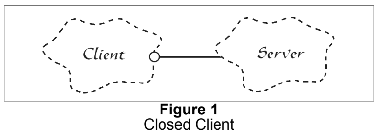
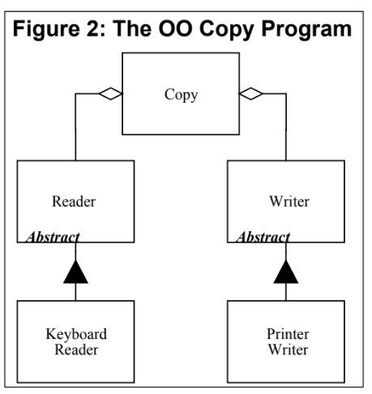
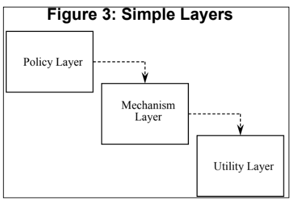

# SOLID 物件導向設計原則

SOLID is a mnemonic acronym for five design principles intended to make software designs more understandable, flexible and maintainable.

- 更能容忍變化, 更彈性
- 更容易理解
- 更好維護

the SOLID principles can also form a core philosophy for methodologies such as agile development or adaptive software development.

- **S**ingle-Responsibility Principle (SRP)
- **O**pen-Closed Principle (OCP)
- **L**iskov Substitution Principle (LSP)
- **I**nterface Segregation Principle (ISP)
- **D**ependency-Inversion Principle (DIP)

---

## Single Responsibility Principle (SRP)

_"A class should have only one reason to change."_ - Robert C. Martin

This design violates the SRP.

The Rectangle class has two responsibilities. 

The first responsibility is to provide a mathematical model of the geometry of a rectangle. 

The second responsibility is to render the rectangle on a graphical user interface.

problem: 
1. we must include the GUI in the computational geometry application. In .NET the GUI assembly would have to be built and deployed with the computational geometry application.
2. if a change to the GraphicalApplication causes the Rectangle to change for some reason, that change may force us to rebuild, retest, and redeploy the ComputationalGeometryApplication. If we forget to do this, that application may break in unpredictable ways.


### Should these responsibilities be separated?

```java
public interface Modem {
    public void Dial(string pno);
    public void Hangup();
    public void Send(char c);
    public char Recv();
}
```

there are two responsibilities being shown here. The first responsibility is connection management. The second is data communication. 

Should these two responsibilities be separated? 

That depends upon how the application is changing. 

If the application changes in ways that affect the signature of the connection functions, then the design will smell of Rigidity because the classes that call send and read will have to be recompiled and redeployed more often than we like.


If, on the other hand, the application is not changing in ways that cause the the two responsibilities to change at differen times, then there is no need to separate them. Indeed, separating them would smell of _Needless Complexity_.


---

## Open-Closed Principle (OCP)

_"Software entities (class, modules, functions, etc.) should be open for extension, but closed for modification."_ - Robert C. Martin

1. They are _“Open For Extension”_.

    This means that the behavior of the module can be extended. That we can make the module behave in new and different ways as the requirements of the application change, or to meet the needs of new applications.

2. They are _“Closed for Modification”_. 

    The source code of such a module is inviolate. No one is allowed to make source code changes to it.

It would seem that these two attributes are at odds with each other. The normal way to extend the behavior of a module is to make changes to that module. A module that cannot be changed is normally thought to have a fixed behavior. How can these two opposing attributes be resolved?

**Abstraction is the Key.**

Figure 1 shows a simple design that does not conform to the open-closed principle. Both the Client and Server classes are concrete. There is no guarantee that the member functions of the Server class are virtual. The Client class uses the Server class.If we wish for a Client object to use a different server object, then the Client class must be changed to name the new server class.



```cpp
enum ShapeType {circle, square};

struct Point {};

struct Shape {
    ShapeType itsType;
};

struct Circle {
    ShapeType itsType;
    double itsRadius;
    Point itsCenter;
};

struct Square {
    ShapeType itsType;
    double itsSide;
    Point itsTopLeft;
};

//
// These functions are implemented elsewhere
//

void DrawSquare(struct Square*);
void DrawCircle(struct Circle*);

typedef struct Shape *ShapePointer;
void DrawAllShapes(ShapePointer list[], int n) {
    int i;
    for (i=0; i<n; i++) {
        struct Shape* s = list[i];
        switch (s->itsType) {
        case square:
            DrawSquare((struct Square*)s);
            break;
        case circle:
            DrawCircle((struct Circle*)s);
            break;
        }
    }
}
```

```cpp
class Shape
{
public:
    virtual void Draw() const = 0;
};
class Square : public Shape
{
public:
    virtual void Draw() const;
};
class Circle : public Shape
{
public:
    virtual void Draw() const;
};
void DrawAllShapes(Set<Shape*>& list)
{
    for (Iterator<Shape*>i(list); i; i++)
        (*i)->Draw();
}
```

### Strategic Closure
It should be clear that no significant program can be 100% closed.

Since closure cannot be complete, it must be strategic. That is, the designer must choose the kinds of changes against which to close his design. This takes a certain amount of prescience derived from experience. The experienced designer knows the users and the industry well enough to judge the probability of different kinds of changes.

---
## Liskov Substitution Principle (LSP)

_"Subtypes must be substitutable for their base types."_ - Robert C. Martin

### A Example of violation of LSP 

```cpp
void DrawShape(const Shape& s)
{
    if (typeid(s) == typeid(Square))
        DrawSquare(static_cast<Square&>(s)); 
    else if (typeid(s) == typeid(Circle))
        DrawCircle(static_cast<Circle&>(s));
}
```

Clearly the DrawShape function is badly formed. It must know about every possible derivative of the Shape class, and it must be changed whenever new derivatives of Shape are created.

### Square and Rectangle, a More Subtle Violation.


```cpp
class Rectangle
{
public:
    void SetWidth(double w) {itsWidth=w;}
    void SetHeight(double h) {itsHeight=w;}
    double GetHeight() const {return itsHeight;}
    double GetWidth() const {return itsWidth;}
private:
    double itsWidth;
    double itsHeight;
};
```
memory problem 

assume that we don't care about memory problem

```cpp
class Rectangle
{
public:
    virtual void SetWidth(double w) {itsWidth=w;}
    virtual void SetHeight(double h) {itsHeight=h;}
    double GetHeight() const {return itsHeight;}
    double GetWidth() const {return itsWidth;}
private:
    double itsHeight;
    double itsWidth;
};

class Square : public Rectangle
{
public:
    virtual void SetWidth(double w);
    virtual void SetHeight(double h);
};
void Square::SetWidth(double w)
{
    Rectangle::SetWidth(w);
    Rectangle::SetHeight(w);
}
void Square::SetHeight(double h)
{
    Rectangle::SetHeight(h);
    Rectangle::SetWidth(h);
}
```

The real problem is

```cpp
void g(Rectangle& r)
{
    r.SetWidth(5);
    r.SetHeight(4);
    assert(r.GetWidth() * r.GetHeight()) == 20);
}
```
we can use factory pattern to solve this problem, because the key point is about constructor

```cpp
struct RectangleFactory
{
    static Rectangle create_rectangle(int w, int h);
    static Rectangle create_square(int size);
}
```

So We must Design by Contract

---

## Interface Segregation Principle (ISP)

_"Clients should not be forced to depend upon interfaces that they don't use."_ - Robert C. Martin

This principle deals with the disadvantages of “fat” interfaces.
Classes that have “fat” interfaces are classes whose interfaces are not cohesive.

In this article we will discuss the disadvantages of “fat” or “polluted” interfacse.

### Interface Pollution

Consider a security system. In this system there are Door objects that can be locked and unlocked, and which know whether they are open or closed. (See Listing 1).

```cpp
class Door
{
public:
    virtual void Lock() = 0;
    virtual void Unlock() = 0;
    virtual bool IsDoorOpen() = 0;
};

class Timer
{
public:
    void Regsiter(int timeout, TimerClient* client);
};

class TimerClient
{
public:
    virtual void TimeOut() = 0;
};
```

Now consider that one such implementation. TimedDoor needs to sound an alarm
when the door has been left open for too long. In order to do this the TimedDoor object communicates with another object called a Timer.

When an object wishes to be informed about a timeout, it calls the Register function of the Timer. The arguments of this function are the time of the timeout, and a pointer to a TimerClient object whose TimeOut function will be called when the timeout expires.

How can we get the TimerClient class to communicate with the TimedDoor class so that the code in the TimedDoor can be notified of the timeout? There are several alternatives. Figure 1 shows a common solution. We force Door, and therefore TimedDoor, to inherit from TimerClient. This ensures that TimerClient can register itself with the Timer and receive the TimeOut message.


But problem is Not all varieties of Door need timing.

Moreover, the applications that use those derivatives will have to #include the definition of the TimerClient class, even though it is not used.
that means you have to recompile.

### Separation through Multiple Inheritance


```cpp
class TimedDoor : public Door, public TimerClient
{
public:
    virtual void TimeOut(int timeOutId);
};
```
---

## Dependency-Inversion Principle (DIP)

- High-level modules should not depend on low-level modules. Both should depend on abstractions.
- Abstractions should not depend on details. Details should depend on abstractions.

### The Definition of a “Bad Design”
1. It is hard to change because every change affects too many other parts of the system. (Rigidity)
2. When you make a change, unexpected parts of the system break. (Fragility)
3. It is hard to reuse in another application because it cannot be disentangled from the current application. (Immobility)

### Example: The "Copy" Program


```cpp
void Copy()
{
int c;
while ((c = ReadKeyboard()) != EOF)
WritePrinter(c);
}
```

consider a new program that copies keyboard characters to a disk file.

the “Copy” module is dependent upon the “Write Printer” module, and so cannot be reused in the new context.

So we can enhance our program.

```cpp
enum OutputDevice {printer, disk};
void Copy(outputDevice dev)
{
    int c;
    while ((c = ReadKeyboard()) != EOF)
        if (dev == printer)
            WritePrinter(c);
        else
            WriteDisk(c);
}
```

However this
adds new interdependencies to the system. As time goes on, and more and more devices must participate in the copy program, the “Copy” module will be littered with if/else statements and will be dependent upon many lower level modules. It will eventually become rigid and fragile.

### Dependency Inversion


```cpp
class Reader
{
public:
    virtual int Read() = 0;
};
class Writer
{
public:
    virtual void Write(char) = 0;
};
void Copy(Reader& r, Writer& w)
{
    int c;
    while((c=r.Read()) != EOF)
        w.Write(c);
}
```

### Layering
According to _Booch_ , _“...all well structured object oriented architectures have clearly-defined layers, with each layer providing some coherent set of services though a well-defined and controlled interface.”_



- is hard to extend
- is hard to change 

it has the insidious characteristic that the Policy Layer is sensitive to changes all the way down in the Utility Layer. _**Dependency is transitive**_.

