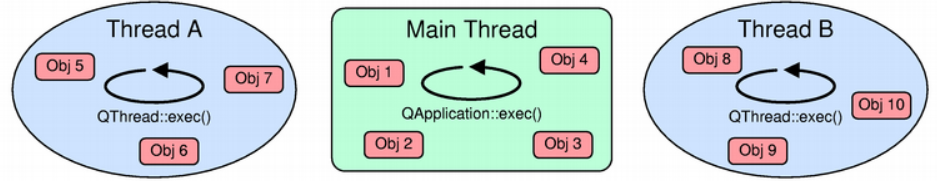

# Qt Threading and Event Loop

## Events and the event loop
An event in Qt is an object which represents something interesting that happened; the main difference between an event and a signal is that events are targeted to a specific object in our application (which decides what to do with that event), while signals are emitted "in the wild". From a code point of view, all events are instances of some subclass of `QEvent`, and all QObject-derived classes can override the `QObject::event()` virtual method in order to handle events targeted to their instances.

Events can be generated from both inside and outside the application; for instance:
- `QKeyEvent` and `QMouseEvent` objects represent some kind of keyboard and mouse interaction, and they come from the window manager;
- `QTimerEvent` objects are sent to a `QObject` when one of its timers fires, and they (usually) come from the operating system;
- `QChildEvent` objects are sent to a `QObject` when a child is added or removed, and they come from inside your Qt application.

The important thing about events is that they're not delivered as soon as they're generated; they're instead queued up in an event queue and sent sometime later. The dispatcher itself loops around the event queue and sends queued events to their target objects, and therefore it is called the event loop. Conceptually, this is how an event loop looks

```cpp
while (is_active)
{
    while (!event_queue_is_empty)
        dispatch_next_event();

    wait_for_more_events();
}
```
event loop by running `QCoreApplication::exec()`;

call blocks until `QCoreApplication::exit()` or `QCoreApplication::quit()` are called, terminating the loop.

The `wait_for_more_events()` function blocks (that is, it's not a busy wait) until some event is generated. for example, the event loop can be woken up by:
- window manager activity (key/mouse presses, interaction with the windows, etc.);
- sockets activity (there's some data available to read, or a socket is writable without blocking, there's a new incoming connection, etc.);
- timers (i.e. a timer fired);
- events posted from other threads (see later).

## What requires a running event loop ?
- **Widgets painting and interaction**:`QWidget::paintEvent()` will be called when delivering `QPaintEvent` objects, which are generated both by calling `QWidget::update`() (i.e. internally) or by the window manager (for instance, because a hidden window was shown). The same thing holds for all kinds of interaction (keyboard, mouse, etc.)
- **Timers**:
- **Networking**: all low-level Qt networking classes (`QTcpSocket`, `QUdpSocket`, `QTcpServer`, etc.) are asynchronous by design. When you call `read()`, they just return already available data; when you call `write()`, they schedule the writing for later. Notice that they do offer synchronous methods (not recommended, it will block event-loop)

## Blocking the event loop
**You should never ever block the event loop**, Suppose you have a Button widget which emits a signal when clicked; connected to this signal there's a slot of our Worker object, like this:

1. `main(int, char )`
2. `QApplication::exec()`
3. `...`
4. `QWidget::event(QEvent)` 
5. `Button::mousePressEvent(QMouseEvent)`
6. `Button::clicked()`
7. `...`
8. `Worker::doWork()`

While the worker is busy working, what's the event loop doing? You should've guessed it: nothing! It dispatched the mouse press event and it's blocked waiting for the event handler to return. We managed to **block the event loop**, which means that no event is sent any more, until we return from the `doWork()` slot, up the stack, to the event loop, and let it process pending events.

Moreover, many window managers will detect that your application is not handling events any more and tell the user that your application isn't responding. That's why is so important to quickly react to events and return to the event loop as soon as possible!

## Forcing event dispatching
So, what do we do if we have a long task to run and don't want to block the event loop? 
-  We move the task into another thread (In the next section).
-  We manually force the event loop to run, by (repeatedly) calling `QCoreApplication::processEvents()` inside our blocking task. `QCoreApplication::processEvents()` will process all the events in the event queue and return to the caller.
```cpp
QNetworkAccessManager qnam;
QNetworkReply *reply = qnam.get(QNetworkRequest(QUrl(…)));
QEventLoop loop;
QObject::connect(reply, SIGNAL (finished()), &loop, SLOT (quit()));
loop.exec();
/* reply has finished, use it */
```
Be very careful when reentering the event loop "by other paths": it can lead to unwanted recursions! Let's go back to the Button example.

1. `main(int, char)`
2. `QApplication::exec()`
3. `[…]`
4. `QWidget::event(QEvent )`
5. `Button::mousePressEvent(QMouseEvent)`
6. `Button::clicked()`
7. `[…]`
8. `Worker::doWork() // first, inner invocation`
9. `QCoreApplication::processEvents() // we manually dispatch events and…`
10. `[…]`
11. `QWidget::event(QEvent * ) // another mouse click is sent to the Button…`
12. `Button::mousePressEvent(QMouseEvent *)`
13. `Button::clicked() // which emits clicked() again…`
14. `[…]`
15. `Worker::doWork() // DANG! we've recursed into our slot.`

A quick and easy workaround for this is passing `QEventLoop::ExcludeUserInputEvents()` to `QCoreApplication::processEvents()`

about deletion:
```cpp
QObject *object = new QObject;
object->deleteLater();
QDialog dialog;
dialog.exec();
```
## Thread and QObject
### Qt naming convention
- **Reentrant:** A class is reentrant if it's safe to use its instances from more than one thread, provided that at most one thread is accessing the same instance at the same time. A function is reentrant if it's safe to invoke it from more than one thread at the same, provided that each invocation references unique data. In other words, this means that users of that class/function must *serialize* all accesses to instances/shared data by means of some *external locking mechanism*.
- **Thread-safe:**  A class is thread-safe if it's safe to use its instances from more than one thread at the same time. A function is thread-safe if it's safe to invoke it from more than one thread at the same time even if the invocations reference shared data.

[see more...](https://doc.qt.io/archives/qt-4.8/threads-reentrancy.html)

### Per-thread event loop
So far we've always talked about "the event loop", taking somehow per granted that there's only one event loop in a Qt application.

Therefore, we say that the **main event loop** is the one created by the thread which invoked `main()`, and started with `QCoreApplication::exec()` (which must be called from that thread). This is also called the **GUI thread**, because it's the only thread in which GUI-related operations are allowed. A QThread local event loop can be started instead by calling `QThread::exec()` (inside its `run()` method):

```cpp
class Thread : public QThread {
protected:
    void run() {
    /* … initialize … */

    exec();
    }
};
```

since Qt 4.4 `QThread::run()` is no longer a pure virtual method; instead, it calls `QThread::exec()`. Exactly like QCoreApplication, QThread has also the `QThread::quit()` and `QThread::exit()` methods to stop the event loop.

A thread event loop delivers events for all QObjects that are **living** in that thread; this includes, by default, all objects that are created into that thread, or that were moved to that thread (more info about this later). We also say that the **thread affinity** of a QObject is a certain thread, meaning that the object is living in that thread. This applies to objects which are built in the constructor of a QThread object:

```cpp
class MyThread : public QThread
{
public:
    MyThread()
    {
        otherObj = new QObject;
    }

private:
    QObject obj;
    QObject *otherObj;
    QScopedPointer<QObject> yetAnotherObj;
};
```

What's the thread affinity of `obj`, `otherObj`, `yetAnotherObj` after we create a MyThread object? We must look at the thread that created them: it's the thread that ran the MyThread constructor. Therefore, all three objects are not living in the MyThread thread, but in the thread that created the MyThread instance (which, by the way, is where the instance is living as well).



It is very important to understand that QObject and all of its subclasses **are not thread-safe** (although they can be reentrant); therefore, you can not access a QObject from more than one thread at the same time, unless you serialize all accesses to the object's internal data (for instance, by protecting it with a mutex). Remember that the object may be handling events dispatched by the event loop of the thread it is living in while you're accessing it from another thread! For the same reason, you can't delete a QObject from another thread, but you must use `QObject::deleteLater()`, which will post an event that will ultimately cause its deletion by the thread the object is living in.

Moreover, QWidget and all of its subclasses, along with other GUI-related classes (even not QObject-based, like QPixmap) are not reentrant either: they can be used exclusively from the GUI thread.

We can change a QObject's affinity by calling `QObject::moveToThread()`; this will change the affinity of the object and of its children. Since QObject is not thread-safe, we must use it from the thread the object is living in; that is, you can only **push** objects from the thread they're living in to other threads, and not **pull** them or move them around from other threads. Moreover, Qt requires that the child of a QObject must live in the same thread where the parent is living. This implies that:

- you can't use `QObject::moveToThread()` on a object which has a parent;
- you must not create objects in a QThread using the QThread object itself as their parent:

```cpp
class Thread : public QThread {
    void run() {
        QObject *obj = new QObject(this); // WRONG!!!!!!!
    }
};
```
This is because the **QThread object is living in another thread**, namely, the one in which it was created.

### Signals and slots across threads
 
When we connect a signal to a slot, the fifth argument of QObject::connect is used to specify the connection type:
- a **direct connection** means that the slot is always invoked directly by the thread the signal is emitted from;
- a **queued connection** means that an event is posted in the event queue of the thread the receiver is living in, which will be picked up by the event loop and will cause the slot invocation sometime later;
- a **blocking queued connection** is like a queued connection, but the sender thread blocks until the event is picked up by the event loop of the thread the receiver is living in, the slot is invoked, and it returns;
- an **automatic connection** (*the default*) means that if the thread the receiver is living in is the same as the current thread, a direct connection is used; otherwise, a queued connection is used.

In every case, keep in mind the thread the emitting object is living in has no importance at all! For instance:

```cpp
class Thread : public QThread
{
    Q_OBJECT

signals:
    void aSignal();

protected:
    void run() {
        emit aSignal();
    }
};

/* … */
Thread thread;
Object obj;
QObject::connect(&thread, SIGNAL (aSignal()), &obj, SLOT (aSlot()));
thread.start();
```

The signal `aSignal()` will be emitted by the new thread; since it is not the thread the Object object is living in, a **queued connection** will be used.

Another common pitfall is the following one:
```cpp
class Thread : public QThread
{
    Q_OBJECT

slots:
    void aSlot() {
        /* … */
    }

protected:
    void run() {
        /* … */
    }
};

/* … */
Thread thread;
Object obj;
QObject::connect(&obj, SIGNAL (aSignal()), &thread, SLOT (aSlot()));
thread.start();
obj.emitSignal();
```
When `obj` emits its `aSignal()` signal, which kind of connection will be used? You should've guessed it: a **direct connection**. That's because the Thread object is living in the thread that emits the signal.

In the `aSlot()`slot we could then access some Thread's member variable while they're being accessed by the `run()` method, which is running concurrently: this is the perfect recipe for disaster.

Yet another example, probably the most important one:
```cpp
class Thread : public QThread
{
    Q_OBJECT

slots:
    void aSlot() {
        /* … */
    }

protected:
    void run() {
        QObject *obj = new Object;
        connect(obj, SIGNAL (aSignal()), this, SLOT (aSlot()));
        /* … */
    }
};
```
In this case a queued connection is used, therefore you're required to run an event loop in the thread the Thread object is living in.

A solution you'll often found in forums, blog posts etc. is to add a `moveToThread(this)` to the Thread constructor
```cpp
class Thread : public QThread {
    Q_OBJECT
public:
    Thread() {
        moveToThread(this); // WRONG
    }

/* … */
};
```

which indeed will work (because now the affinity of the Thread object changed), but it's a very bad design. What's wrong here is that we're misunderstanding the purpose of a thread object (the QThread subclass): QThread objects are not threads; they're control objects around a thread, therefore meant to be used from another thread (usually, the one they're living in).

**A good way to achieve the same result** is splitting the "working" part from the "controller" part, that is, writing a QObject subclass and using `QObject::moveToThread()` to change its affinity:

```cpp
class Worker : public QObject
{
    Q_OBJECT

public slots:
    void doWork() {
        /* … */
    }
};

/* … */
QThread *thread = new QThread;
Worker *worker = new Worker;
connect(obj, SIGNAL (workReady()), worker, SLOT (doWork()));
worker->moveToThread(thread);
thread->start();
```

### DOs and DON'Ts
**You can:**
- add signals to a QThread subclass. It's perfectly safe and they'll do the "right thing" (see above; the sender's thread affinity does not matter).

**You shouldn't:**
- use `moveToThread(this)`.
- force the connection type: this usually means that you're doing something wrong, like mixing the control interface of QThread with the program logic (which should stay in a separate object which lives in that thread).
- add slots to a QThread subclass: they'll be invoked from the "wrong" thread, that is, not the one the QThread object is managing, but the one that object is living in, forcing you to specify a direct connection and/or to use moveToThread(this).
- use QThread::terminate.

**You must no:**
- quit your program when threads are still running. Use `QThread::wait` to wait for their termination.
- destroy a QThread while the thread that it's managing is still running. If you want some kind of "self-destruction", you can connect the `finished()` signal with the `deleteLater()` slot. 

## When shouldn't I use threads?
- Timer
- Networking/State mechines
- Jobs splittable in chunks , like this:

```cpp
class Worker : public QObject
{
    Q_OBJECT
public slots:
    void startProcessing()
    {
        processItem(0);
    }

    void processItem(int index)
    {
        /* process items[index] … */

        if (index < numberOfItems)
            QMetaObject::invokeMethod(this,
                                      "processItem",
                                      Qt::QueuedConnection,
                                      Q_ARG(int, index + 1));
    }   
};
```

## Thread Support in Qt

- [The Threading Classes](https://doc.qt.io/qt-5/threads.html)
- [Multithreading Technologies in Qt](https://doc.qt.io/qt-5/threads-technologies.html)
- [Synchronizing Threads](https://doc.qt.io/qt-5/threads-synchronizing.html)

### 參考資料

qt event and thread: https://wiki.qt.io/Threads_Events_QObjects

qt thread basic: https://doc.qt.io/qt-5/thread-basics.html

qt threading :https://doc.qt.io/qt-5/threads.html