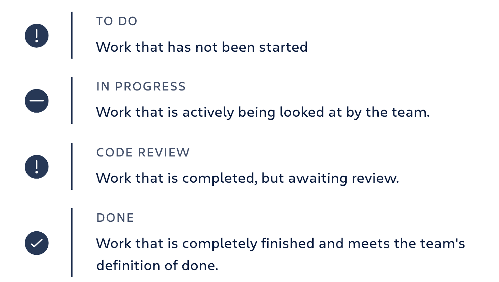
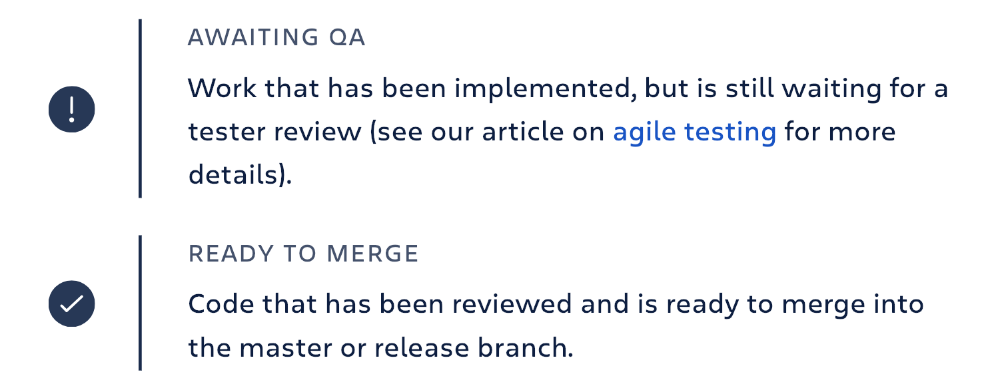

# Jira Introduction

## Workflow
Every software team has a process they use to complete work. Normalizing that process–i.e., establishing it as a workflow–makes it clearly structured and repeatable, which, in turn, makes it scalable.

In an issue tracker, these statuses flow from one to the next using transitions which structure the workflow. 

Some software teams include additional states in their workflow that help them track the status of work more precisely.

Discuss each pain point in the team's retrospective, and keep in mind that each team will have slightly different values based on their project, technology stack, and method in which they like to work. That's why it's important to choose an issue tracker that has a flexible workflow configuration. Too many teams compromise their work style to fit a particular toolset, which is frustrating for everyone. So team members start to avoid using that tool altogether, compounding frustration across the team and generally wreaking havoc. And when morale falls, productivity suffers. That's a double whammy we all want to avoid!  

### Optimize the workflow
When building a workflow, think about which metrics are important to report on and what non-team members might be interested in learning. For example, a well designed workflow answers the following questions:

- What work has the team completed?
- Is the backlog of work increasing or keeping pace with the team?
- How many items are in each status?
- Are there any bottlenecks that are slowing the team down?
- How long does it take to complete an average task?
- How many work items didn't pass our quality standards the first time around?

The next step in optimizing the workflow is to ensure a steady stream of work through the workflow. Work-in-progress (WIP) limits dictate a minimum and maximum number of issues in a particular state of the workflow, making sure each state in the workflow has enough work to keep the team fully utilized, but not so much that they lose focus because they're juggling priorities. Enforcing work-in-progress limits will quickly show which processes in the team are slowing down the overall work through the pipeline. As the team learns to optimize around its work-in-progress limits, throughput will increase. 

No matter what your workflow looks like, the process of developing it should be agile, too. Discuss it in retrospectives from time to time, and adapt it as the team's culture and composition changes.

---

## Epics, Stories, Themes, and Initiatives

Let’s say you and your team want to do something ambitious, like launch a rocket into space. To do so, you’ll need to structure your work: from the largest objectives down to the minute details. You’ll want to be able to respond to change, report your progress, and stick to a plan. Epics, stories, themes, and initiatives are precisely the tools you’ll need to do so.

### What are stories, epics, initiatives, and themes?
- **Stories**, also called “user stories,” are short requirements or requests written from the perspective of an end user.
- **Epics** are large bodies of work that can be broken down into a number of smaller tasks (called stories).
- **Initiatives** are collections of epics that drive toward a common goal.
- **Themes** are large focus areas that span the organization.

### Epics vs. Stories
Oftentimes, developers would work on dozens of stories a month. Epics, in contrast, are few in number and take longer to complete. Teams often have two or three epics they work to complete each quarter.

####  Examples of an agile story:
- iPhone users need access to a vertical view of the live feed when using the mobile app.
- Desktop users need a “view fullscreen” button in the lower right hand corner of the video player.
- Android users need to be linked to apple store.

In this case, the epic might be **“Improve Streaming Service for Q1 Launch.”**

### Epics vs. Initiatives
Initiatives offer another level of organization above epics. In many cases, an initiative compiles epics from multiple teams to achieve a much broader, bigger goal than any of the epics themselves. While an epic is something you might complete in a month or a quarter, initiatives are often completed in multiple quarters to a year.

#### Example of epics in an initiative:
Let’s say your rocket ship company wants to decrease the cost per launch by 5% this year. That’s a great fit for an initiative, as no single epic could likely achieve that big of a goal. Within that initiative, there would be epics such as, “Decrease launch-phase fuel consumption by 1%,” “Increase launches per quarter from 3 to 4,” and “Turn all thermostats down from 71 to 69 degrees #Dadmode.”

#### At Atlassian:
Internally, we call our Initiatives “PC Tickets.” Project Central tickets are configured in Jira Software just like our epics. 

### Initiatives vs. themes
In many organizations the founders and management team will encourage the pursuit of some aspirational destination. These are the (sometimes super corny) goals announced each year or quarter, and themes are how you keep track of them.

- Initiatives are collections of epics
- Themes are labels that track high-level organizational goals

Themes should inspire the creation of epics and initiatives but don’t have a ridgid 1-to-1 relationship with them. A theme for a rocket ship company would be something like “Safety First.”