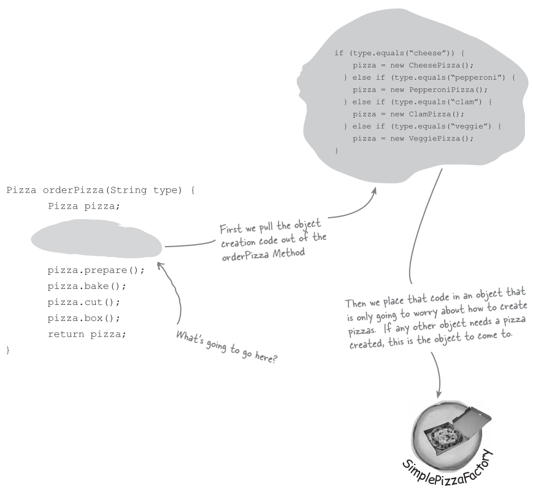
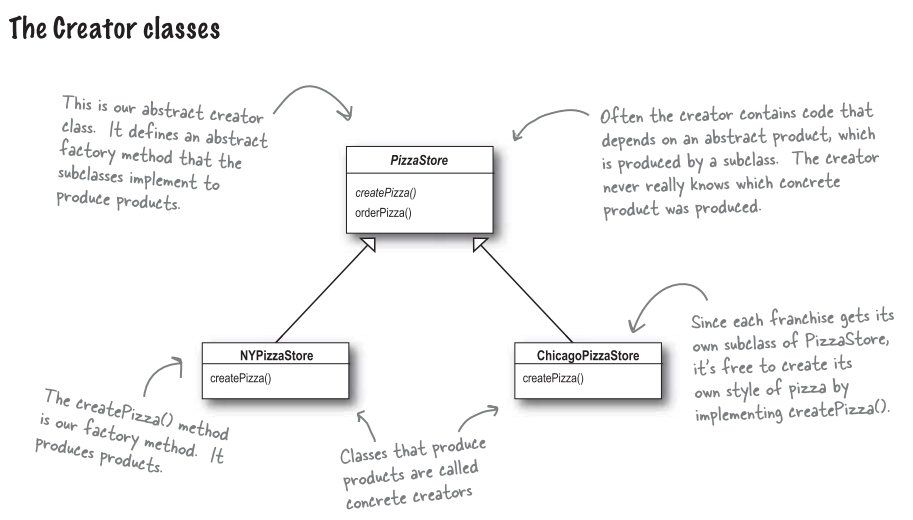

# 工廠模式 (Factory pattern)

### 比薩店
假設我們有一間比薩店:

### 但是你可以需要更多種口味

若想要新增或是減少口味，就需要改動到 `orderPizza()` 內的程式碼。很明顯的，如果具象化某些具象類別 (而不是抽象類別)，將會無法讓 `orderPizza()` 對修改封閉。

### 封裝建立物件的程式碼

### 我們稱這個新物件為 "工廠"
工廠 (factory) 負責建立物件的細節。一旦有了 `SimplePizzaFactory`，`orderPizza()` 就變成此物件的客戶。

### 建立一個簡單的比薩工廠

### FAQ
問: 這個做有什麼好處? 似乎只是把問題搬到另一個物件罷了，問題依然存在。

答: `SimplePizzaFactory` 可以有很多客戶。雖然目前只有 `orderPizza()`，然而，可能還有 `PizzaShopMenu` 類別，會利用這個工廠取得比薩的價格跟描述。可能還有 `HomeDelivery` 類別，會用不同的方式來處理比薩。所以，把比薩的程式碼封裝到一個類別，當以後實踐改變時，只需要修改這個類別就即可。

### 修改 PizzaStore 類別

### 定義簡單工廠
簡單工廠其實不是設計模式，反而比較像是一種編程習慣，的確也有不少開發者把它誤認為 "工廠模式" (factory pattern)，別以為它不是個模式就忽略它的用法。讓我們來看看新版的比薩店類別圖。

### 加盟比薩店

### 我們已經有個作法
我們利用 `SimplePizzaFactory`，寫出三種不同的工廠，分別是 `NYPizzaFactory`，`ChicagoPizzaFactory`，`CaliforniaPizzaFactory`，那麼各地加盟店都可以有適合的工廠可以用。

### 但是你想要多一些品質控制
在推廣 `SimpleFactory` 時，你發現加盟店的確是使用你的工廠製造的比薩，但是其他部分，卻開始採用自創的流程: 烘培的做法有些差異，忘記切片，使用其他廠商的盒子。

再想想這個問題，你真的希望能夠建立一個框架，把加盟店和製造比薩綑綁在一起，卻又不失彈性。

### 給比薩店使用的框架
有個做法可以達到這個效果，所要做的事，就是把 `createPizza()` 方法放回 `PizzaStore` 之中，不過要把它設為 "抽象方法"，然後為每個區域口味，撰寫一個 `PizzaStore` 的次類別。

首先，先來看看 `PizzaStore` 的改變:

### 允許次類別做決定

### 讓我們來開一家比薩店吧

### 實踐比薩

### 來定義紐約和芝加哥風味的起司比薩

### 測試成果

### 會見工廠方法模式的時刻終於到了
工廠方法模式 (Factory Method Pattern) 讓次類別決定該建立的物件為何，據此達到將物件建立的過程封裝的目的。

### 定義工廠方法模式
"工廠方法模式" 定義了一個建立物件的介面，但由次類別決定要實體化的類別為何。工廠方法讓類別把實體化的動作，交由次類別進行。

### 看看物件的相依性
當直接實體化一個物件，就是在依賴它的具象類別。看看下面的例子，它是由比薩店類別實體化所有比薩物件，而不是委由工廠製造。

### 依賴反轉守則 (DIP)

#### 設計守則
依賴抽象類別，不要依賴具象類別。

### 守則的運用
雖然已經建立了一個抽象類別 (Pizza)，但我們未曾在程式碼中應用到，所以這個抽象類別沒有影響力。

如何在 `orderPizza()` 方法中，將這些實體化的程式碼獨立開來? 我們都知道，工廠方法剛好能派上用場。

像是這樣子:

### FAQ
問: 依賴反轉守則，究竟反轉在哪裡?

答: 看看前一張圖，注意到低階元件，現在竟然也依賴高階的抽象。同樣的，高階元件現在也依賴相同的抽象。前幾頁所繪製的相依是由上而下的，現在卻倒過來了，而且高階與低階模組現在都依賴這個抽象。

### 再回到比薩店
要如何確保每家加盟店使用高品質的原料? 你打算建造一家生產原料的工廠，並將原料運送到各家加盟店。

對於這個做法，還剩下一個問題未解決: 加盟店坐落在不同的區域，紐約的紅醬料跟芝加哥的紅醬料是不一樣的。所以對於紐約和芝加哥，你準備兩組不同的原料:

### 原料家族
紐約和芝加哥使用不同組原料。可能不久之後加州就要有加盟店，到時候又需要另一組區域的原料。我們想清楚如何處裡原料的家族。

### 建立原料工廠
先開始定義一個介面，這個介面負責建立所有的原料:

### 建立紐約原料工廠

### 修改比薩

### 再回到比薩店

### 我們做了些什麼事?
我們在此導入新型態的工廠，也就是所謂的抽象工廠，用來建立比薩原料家族。

透過抽象工廠所提供出來的介面，可以建立產品的家族，利用這些介面，把實際製造產品的工廠鬆綁，以便實踐各式各樣的工廠，製造出各種不同的產品。

### 定義抽象工廠模式
抽象工廠模式提供出來了一個介面，建立相關或相依物件之家族，而不需要明確指定具象類別。

### 讓我們從 PizzaStore 的觀點看它

### 比較工廠方法以及抽象工廠

