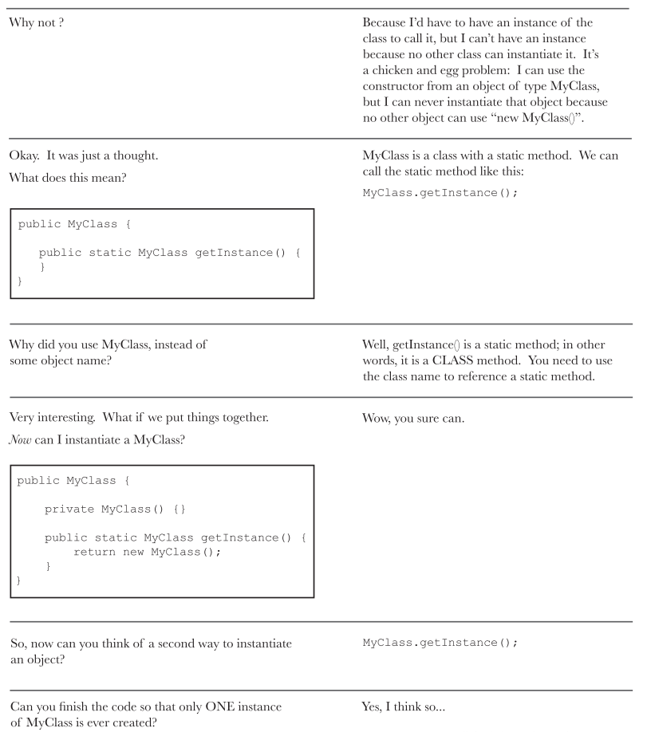
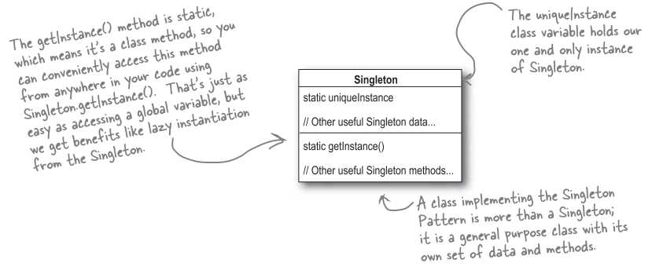

# 獨體 (單例) 模式 (Singleton Pattern)

獨體模式，用來建立獨一無二的物件，只能有一個實體的物件。

### FAQ
A: 這有什麼用處?

B: 有一些物件只需要一個實體，比方說:執行緒池 (thread pool)，快取區 (cache)，對話盒，處理偏好設定和登錄 (registry) 的物件，登入系統的物件，和驅動程式溝通的物件。事實上，這些物件都只能有一個實體，如果製造出多個實體，就會導致許多問題產生，例如: 程式的行為異常，資源使用過量，或是不一致的結果。

A: 但是這需要花整個章節來介紹嗎? 難道不能靠程式員之間的約定，或是利用全域變數，靜態變數就可以做到了。

B: 的確透過程式員之間的約定就可以達成。但是獨體模式可以在任何地方存取這個實體，有如同全域變數般的方便，卻沒有全域變數的缺點。

A: 什麼缺點?

B: 舉例來說: 如果將物件指定到一個全域變數，那麼必須在程式一開始就建立好物件，萬一這個物件非常耗費資源，而程式在這次執行當中，一直沒有用到這個物件，不就形成一種浪費? 獨體模式可以在需要時才建立。

### 剖析獨體模式設計

### 巧克力工廠
大家都知道，現代化的巧克力工廠具備電腦控制的巧克力鍋爐。

這裡有一個量產用的巧克力鍋爐。看看它的程式，將發現程式寫的相當小心，努力防止不好的事情發生。例如: 排出 500 加侖的未煮沸混合物，或者鍋爐已經滿了還繼續放進原料，或者鍋爐內沒放原料就開始空燒。

你可能會擔心，萬一同時有兩個 `ChocolateBoiler` (巧克力鍋爐) 實體，可能將發生很糟糕的事情。

### 定義獨體模式
獨體模式確保一個類別只有一個實體，並給它一個存取的全域點 (global point)。

