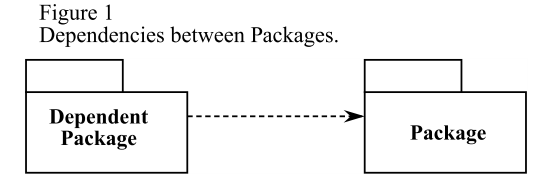

## The Acyclic Dependencies Principle (ADP)
*"THE DEPENDENCY STRUCTURE BETWEEN PACKAGES MUST BE A DIRECTED ACYCLIC GRAPH (DAG). THAT IS, THERE MUST BE NO CYCLES IN THE DEPENDENCY STRUCTURE."*

none of the teams are at the mercy of the others. Changes made to one package do not need to have an immediate affect on other teams. Each team can decide for itself when to adapt its packages to new releases of the packages they use.

This is a very simple and rational process. And it is widely used. However, to make it work you must manage the dependency structure of the packages. There can be no cycles.

Packages depend upon one another. Specifically, a class in one package may `#include` the header file of a class in a different package. This can be depicted on a class diagram as a dependency relationship between packages (See Figure 1).

Packages, in UML 9.0 are depicted as “tabbed folders”. Dependency relationships are dashed arrows. The arrows point in the direction of the dependency. That is, the arrow head is placed next to the package that is being depended upon. In C++ terms, there is a `#include` statement in a class within the dependent package that references the header
file of a class in the package being depended upon.

Now notice one more thing. Regardless of which package you begin at, it is impossible to follow the dependency relationships and wind up back at that package. This structures has no cycles. It is a *directed acyclic graph*. (DAG).

Notice also that when MyDialogs is released it has utterly no affect upon many of the other packages in the system. They don’t know about MyDialogs; and they don’t care when it changes. This is nice. It means that the impact of releasing MyDialogs is relatively small. 

When it is time to release the whole system; it is done from the bottom up. First the Windows package is compiled, tested, and released. Then MessageWindow and Mydialogs. These are followed by Task, and then TaskWindow and Database. MyTasks is next; and finally MyApplication. This process is very clear and easy to deal with. We know how to build the system because we understand the dependencies between its parts.

### The Effect of a Cycle in the Package Dependency Graph.
Let us say that the a new requirement forces us to change one of the classes in MyDialogs such that it #includes one of the class headers in MyApplication. This creates a dependency cycle as shown in Figure 3.

This cycle creates some immediate problems. For example, the engineers responsible for the MyTasks package know that in order to release, they must be compatible with Task, MyDialogs, Database, and Windows. However, with the cycle in place, they must now also be compatible with MyApplication, TaskWindow and MessageWindow. That is, MyTasks now depends upon *every other package in the system*.This makes MyTasks very difficult to release. MyDialogs suffers the same fate. In fact, the cycle has had the effect that MyApplication, MyTasks, and MyDialogs must always be released at the same time.

But this is just the tip of the trouble. Consider what happens when we want to unit test the Mydialogs package. We find that we must link in every other package in the system; including the Database package. This means that we have to do a complete build just to unit test MyDialogs. This is intolerable.

### Breaking the Cycle.
It is always possible to break a cycle of packages and reinstate the dependency graph as a DAG. There are two primary mechanisms.

1. Apply the Dependency Inversion Principle (DIP). In the case of Figure 3, we could create an abstract base class that has the interface that MyDialogs needs. We could then put that abstract base into MyDialogs and inherit it into MyApplication. This inverts the dependency between MyDialogs and MyApplication thus breaking the cycle. See Figure 4.
2. Create a new package that both MyDialogs and MyApplication depend upon. Move the class(es) that they both depend upon into that new package.

### The "Jitters"
The second solution implies that the package structure is not stable in the presence of changing requirements. Indeed, as the application grows, the package dependency structure jitters and grows. Thus the dependency structure must always be monitored for cycles. When cycles occur they must be broken somehow. Sometimes this will mean creating new packages, making the dependency structure grow.
